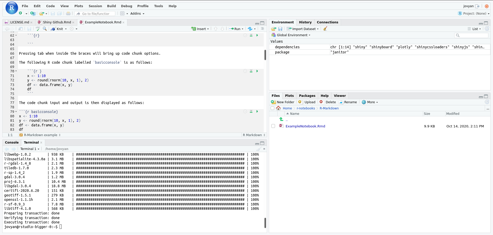

# Sélectionner une Image pour votre Serveur Bloc-Notes

Selon votre projet ou votre utilisation souhaitée du serveur bloc-notes,
certaines images seront plus appropriées que d'autres.

Ce qui suit passera en revue quelques caractéristiques de chaque image pour vous
aider à choisir.

Lors de la sélection, vous avez 3 options principales:

- Bloc-Notes Jupyter (CPU, TensorFlow, PyTorch)
- RStudio
- Bureau Virtuel (r, Geomatics)

## Jupyter

Les [Bloc-Notes Jupyter](https://jupyter.org/) sont utilisés pour créer et
partager des documents interactifs qui contiennent un mélange de code en direct,
de visualisations et de texte. Ceux-ci peuvent être écrits en `Python`,` Julia`
ou `R`.

<!-- prettier-ignore -->
??? info "La plupart des utilisations comprennent:"
    la transformation de données, la simulation numérique, la modélisation statistique, l'apprentissage machine et autres.

Ceux-ci s'agit d'un excellent outil pour l'analyse, y compris l'apprentissage
machine. L'image `jupyterlab-cpu` fournit une bonne expérience de base pour
`python`, y compris des paquets tels que `numpy`, `pandas` et `scikit-learn`. Si
vous êtes intéressé spécifiquement par **_TensorFlow_** ou **_PyTorch_**, nous
avons également les images `jupyterlab-tensorflow` et` jupyterlab-pytorch` qui
viennent avec ces outils pré-installés.

Chaque image est préchargée avec VS Code dans le navigateur si vous préférez une
expérience IDE complète.

### RStudio

**[RStudio](RStudio/)** vous offre un environnement de développement intégré
spécifiquement pour `R`. Si vous codez en `R`, il s'agit généralement du serveur
bloc-notes utiliser. Utilisez l'image `rstudio` pour obtenir un environnement
RStudio.

### Bureau Virtuel

Pour une expérience Ubuntu complète, deux versions du Bureau Virtuel sont
disponible. Ceux-ci sont préchargés avec Python et R, mais sont livrés dans un
expérience typique qui est également fournie avec _Firefox_, _VS Code_ et les
outils _Open Office_. Le système d'exploitation est
**[Ubuntu](https://ubuntu.com/about)** 18.04 avec l'environnement de bureau
**[XFCE](https://www.xfce.org/about)**.

`remote-desktop-r` inclut R et RStudio mais si vous avez besoin d'outils de
géomatique pour R, choisissez la version `remote-desktop-geomatics` de cette
image.

