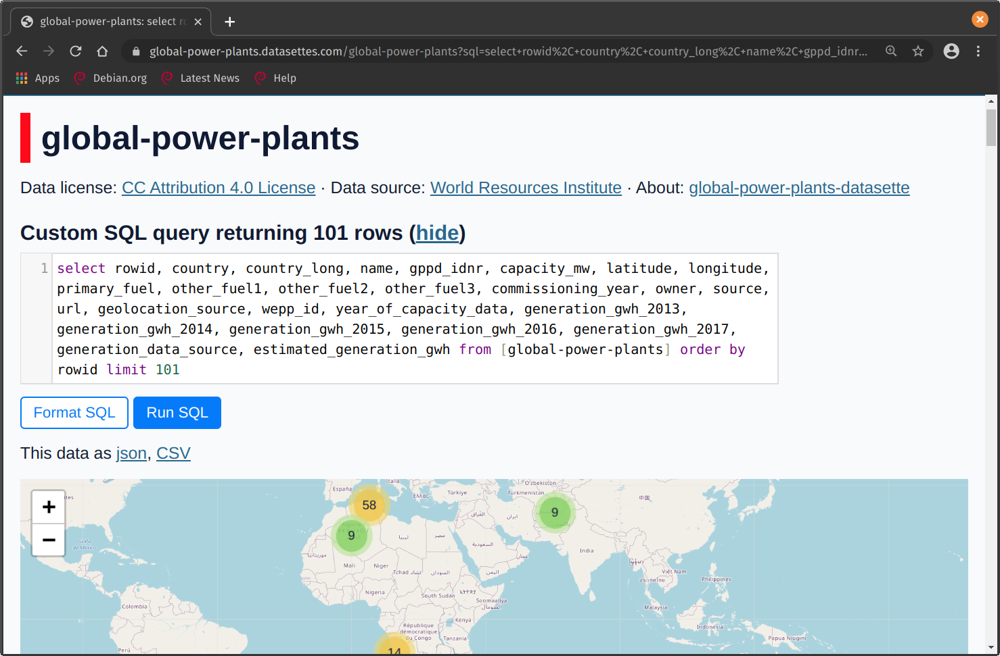

# Explore your data with Datasette

Datasette est une API JSON instantanée pour vos bases de données SQLite qui
permet d'explorer la BD et d'exécuter des requêtes SQL de manière plus
interactive.

Vous pouvez trouver une liste d'exemples de datasettes
[ici](https://github.com/simonw/datasette/wiki/Datasettes).

<!-- prettier-ignore -->
!!! faq "Écosystème de Datasette"
    Il existe toutes sortes d'outils pour convertir des données depuis et vers sqlite. [ici](https://docs.datasette.io/en/stable/ecosystem.html). Par exemple, vous pouvez charger des fichiers de forme dans sqlite, ou créer des graphes [Vega](https://vega.github.io/vega/) à partir d'une base de données sqlite. SQLite fonctionne bien avec `R`, `Python`, et plusieurs autres outils.

## Example Datasette

Voici quelques aptures d'écran du Datasette
[global-power-plants](https://global-power-plants.datasettes.com), vous pouvez
prévisualiser et explorer les données dans le navigateur, que ce soit par des
clics ou des requêtes SQL.



Vous pouvez même explorer des cartes au sein de l'outil!

[Exécuter des requêtes SQL](../images/datasette-sql.png)

# Starting Datasette

Pour visualiser votre base de données dans votre bloc-note Jupyter, créez le
fichier _bash_ suivant dans votre répertoire de projet et exécutez-le avec
`./start.sh`. Accédez au serveur web en utilisant le
[URL de base](#running-your-Notebook-server-and-accessing-the-port) avec le
numéro de port que vous utilisez dans le fichier ci-dessous.

**start.sh**

```bash
#!/bin/bash

# This script just starts Datasette with the correct URL, so
# that you can use it within kubeflow.

# Get an example database
wget https://github.com/StatCan/R-notebooks/raw/master/database-connections/latin_phrases.db

# If you have your own database, you can change this line!
DATABASE=latin_phrases.db

export BASE_URL="https://kubeflow.covid.cloud.statcan.ca${JUPYTER_SERVER_URL:19}proxy/8001/"
echo "Base url: ${BASE_URL}"
datasette $DATABASE --cors --config max_returned_rows:100000 --config sql_time_limit_ms:5500 --config base_url:${BASE_URL}
```

<!-- prettier-ignore -->
!!! example "Regardez ce tutoriel"
    Un utilisateur de la plateforme a utilisé Datasette avec un tableau de bord. Voir la [vidéo](https://www.youtube.com/watch?v=OPVfBKouBT8&feature=emb_logo) pour une démonstration.

<!-- prettier-ignore -->
!!! danger "Exécuter le serveur de votre Notebook et accéder au port"
    Lorsque vous exécutez un outil depuis votre bloc-note Jupyter qui affiche un site web sur un port, vous ne serez pas en mesure d'y accéder simplement à partir de `http://localhost:5000/` comme normalement suggéré dans la sortie lors de l'exécution de l'application web.

    Pour accéder au serveur web, vous devrez utiliser l'URL de base. Dans le terminal du bloc-note, exécutez:

    ```python
    echo https://kubeflow.covid.cloud.statcan.ca${JUPYTER_SERVER_URL:19}proxy/5000/
    ```
