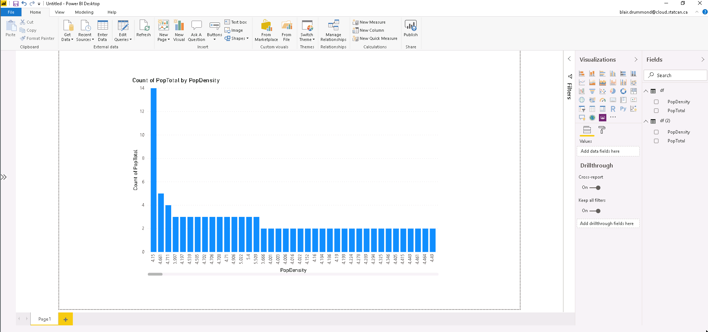
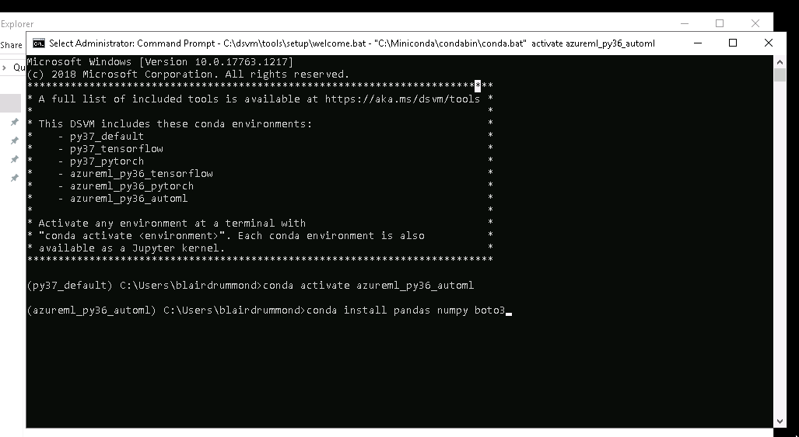

Nous ne proposons pas de serveur PowerBI, mais vous pouvez extraire vos données
dans PowerBI à partir de notre système de stockage et les utiliser comme une
fiche de données `pandas`.

## Ce dont vous aurez besoin

1. Un ordinateur avec PowerBI et Python 3.6
2. Vos `ACCESS_KEY` et `SECRET_KEY` MinIO (voir [Stockage](/daaas/fr/Stockage))

## Connectez-vous

### Configurez PowerBI

Ouvrez votre système PowerBI et ouvrez
[démarrage rapide de PowerBI](https://raw.githubusercontent.com/StatCan/jupyter-notebooks/master/querySQL/power_bi_quickstart.py)
dans votre éditeur de texte préféré.

Assurez-vous que `pandas`, `boto3` et `numpy` sont installés et que vous
utilisez le bon environnement virtuel Conda (le cas échéant).

Ensuite, assurez-vous que PowerBI utilise le bon environnement Python. Vous
pouvez modifier cet élément à partir du menu des options. Le chemin d'accès
exact est indiqué dans le guide de démarrage rapide.

### Modifiez votre script Python

Ensuite, modifiez votre script Python pour utiliser vos `ACCESS_KEY` et
`SECRET_KEY` MinIO, puis cliquez sur "Get Data" et copiez-le en tant que script
Python.

