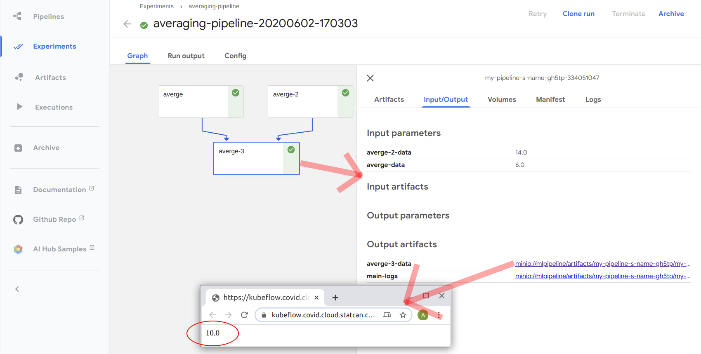

# Aperçu

[Kubeflow Pipelines](https://www.kubeflow.org/docs/pipelines/overview/pipelines-overview/)
est une plateforme permettant de créer des flux de travail d’apprentissage
automatique pouvant être déployés dans un environnement Kubernetes. Il permet de
créer des _pipelines_ qui encapsulent les flux de travail analytiques
(transformation de données, entraînement de modèles, création d’éléments
visuels, etc.). Ces _pipelines_ peuvent être mis en commun, réutilisés et
programmés. Ils sont créés de façon à être exécutés avec les calculs fournis par
Kubernetes. Voici un exemple de pipeline contenant de nombreuses étapes `sample`
se transformant en une seule étape `average`. Cette image provient de
l’[interface utilisateur de Kubeflow Pipelines](../1-Experiments/Kubeflow.md).


Dans le contexte de l’espace de travail d’analytique avancée, vous pouvez
interagir avec les pipelines au moyen de :

- l’[interface utilisateur de Kubeflow](../1-Experiments/Kubeflow.md), où vous
  pouvez télécharger des pipelines à partir du menu Pipelines, visualiser vos
  pipelines et leurs résultats, etc.
- la trousse [SDK](https://www.kubeflow.org/docs/pipelines/sdk/sdk-overview/)
  pour Python de Kubeflow Pipelines, accessible au moyen de
  [serveurs de bloc-notes Jupyter](../1-Experiments/Kubeflow.md#create-a-server),
  où vous pouvez définir vos composants et pipelines et les soumettre pour les
  exécuter immédiatement, ou les enregistrer pour plus tard.

<!-- prettier-ignore -->
??? example "Plus d’exemples dans les blocs-notes"
    Des exemples plus exhaustifs de pipelines produits expressément pour cette plateforme sont 
    accessibles dans [GitHub](https://github.com/StatCan/jupyter-notebooks) (et dans
    chaque serveur de bloc-notes à `/jupyter-notebooks`). Vous pouvez également consulter des 
    [sources publiques](https://github.com/kubeflow/pipelines/tree/master/samples).

Voir
[les documents officiels de Kubeflow](https://www.kubeflow.org/docs/pipelines/overview/pipelines-overview/)
pour obtenir une explication plus détaillée de Kubeflow Pipelines.

# Que sont les pipelines et comment fonctionnent-ils?

Un
[_pipeline_](https://www.kubeflow.org/docs/pipelines/overview/concepts/pipeline/)
dans Kubeflow Pipelines comprend un ou plusieurs
[_composants de pipeline_](https://www.kubeflow.org/docs/pipelines/overview/concepts/component/)
enchaînés pour former un flux de travail. Les _composants_ sont semblables à des
fonctions et décrivent les différentes étapes de votre flux de travail (comme
l’extraction des colonnes d’un magasin de données, la transformation des données
ou l’entraînement d’un modèle). Le _pipeline_ est la logique qui assemble les
_composants_ entre eux. Par exemple :

1. Exécuter Composant-A
2. Transmettre les données de sortie du Composant-A au Composant-B et au
   Composant-C
3. ...

Dans l’image ci-dessus, la logique permettrait d’exécuter de nombreuses étapes
`sample`, suivies d’une seule étape `average`.

Chaque _composant_ a essentiellement :

- une application autonome, empaquetée en tant qu’
  [image Docker](https://docs.docker.com/get-started/), pour effectuer le
  travail proprement dit; le code de l’image Docker peut être un script
  interpréteur de commandes, un script Python ou tout autre code pouvant être
  exécuté à partir d’un terminal Linux, et il aura généralement une interface de
  ligne de commande pour l’échange de données (accessible au moyen de
  `docker run`)
- un fichier YAML qui décrit la manière dont Kubeflow Pipelines exécute ce code
  (l’image Docker qui doit être exécutée, les arguments de ligne de commande
  qu’il accepte, le résultat qu’il produit).

Chaque _composant_ doit être **spécialisé**, **modulaire** et **réutilisable**.

# Définissez et exécutez votre premier pipeline en utilisant la trousse SDK pour Python

Bien que les _pipelines_ et les _composants_ soient définis dans Kubeflow
Pipelines par des fichiers YAML qui utilisent des images Docker, cela ne
signifie pas qu’il faut travailler directement avec les fichiers YAML ou les
images Docker. Dans la trousse
[SDK de Kubeflow Pipelines](https://www.kubeflow.org/docs/pipelines/sdk/sdk-overview/),
on peut définir un _pipeline_ et ses _composants_ directement en code Python,
que la trousse SDK traduit ensuite en fichiers YAML.

Pour notre premier exemple, définissons un
[pipeline simple](https://github.com/StatCan/jupyter-notebooks/blob/master/kfp-basics/average_with_docker_components.ipynb)
en utilisant uniquement la trousse SDK pour Python. Cette section vise
uniquement à donner des renseignements d’ordre général sur la création de
_composant_ et de _pipeline_. Des renseignements plus détaillés sur la
définition de vos propres _composants_, la transmission de données entre
_composants_ et le retour de données de votre _pipeline_ sont fournis dans les
sections suivantes.

Le pipeline que nous définissons pour la démonstration

1.  accepte cinq nombres comme arguments;
2.  donne la moyenne des trois premiers nombres;
3.  donne la moyenne des deux derniers nombres;
4.  donne la moyenne des résultats de (2) et de (3).

Pour ce faire, nous allons d’abord définir notre _composant_. Notre composant
`average` va appeler une image Docker qui

- accepte un ou plusieurs nombres comme arguments de ligne de commande;
- renvoie la moyenne de ces nombres en les inscrivant dans un fichier de sortie
  dans le conteneur (par défaut, dans `out.txt`).

Cette image Docker est déjà créée et stockée dans notre registre de conteneurs
ici : `k8scc01covidacr.azurecr.io/kfp-components/average:v1`. Ne vous inquiétez
pas si vous ne connaissez pas Docker : puisque l’image est déjà créée, il suffit
d’indiquer à Kubeflow Pipelines où elle se trouve.

<!-- prettier-ignore -->
??? info "Tous les détails de l’image Docker du composant `average` sont dans 
    [GitHub](https://github.com/StatCan/jupyter-notebooks/tree/master/kfp-basics/containers/average)."
    Cette image exécute effectivement le code suivant (légèrement nettoyé par 
    souci de brièveté). En faisant accepter à `average.py` un ensemble arbitraire de nombres comme 
    entrées, nous pouvons utiliser le même _composant_ `average` pour toutes les étapes de notre 
    _pipeline_ :

        import argparse

        def parse_args():
            parser = argparse.ArgumentParser(description="Renvoie la moyenne d’un ou de "
                                             "plusieurs nombres en tant que fichier JSON")
            parser.add_argument("numbers", type=float, nargs="+", help="Un ou plusieurs nombres")
            parser.add_argument("--output_file", type=str, default="out.txt", help="Nom de fichier "
                                "où inscrire les nombres de sortie")
            return parser.parse_args()

        if __name__ == '__main__':
            args = parse_args()
            numbers = args.numbers
            output_file = args.output_file

            print(f"Calcul de la moyenne des nombres : {numbers}")
            avg = sum(numbers) / len(numbers)
            print(f"Résultat = {avg}")

            print(f"Écriture de la sortie dans le fichier {output_file}")
            with open(output_file, 'w') as fout:
                fout.write(str(avg))

            print("Terminé")

Pour faire de notre image `average` un _composant_ de Kubeflow Pipelines, nous
créons un `kfp.dsl.ContainerOp` en Python qui définit la manière dont Kubeflow
Pipelines interagit avec notre conteneur, en précisant

- l’emplacement de l’image Docker à utiliser;
- la manière de transmettre les arguments au conteneur en cours d’exécution;
- les sorties attendues du conteneur.

Nous pourrions utiliser `ContainerOp` directement, mais comme nous utiliserons
`average` plusieurs fois, nous créons plutôt une fonction d’usine que nous
pourrons réutiliser :

```python
from kfp import dsl

def average_op(*numbers):
    """
    Usine de ContainerOps moyens

    Accepte un nombre arbitraire de nombres d’entrée, en retournant un ContainerOp qui
    transmet ces nombres à l’image Docker sous-jacente pour établir la moyenne

    Renvoie le résultat recueilli à partir du fichier ./out.txt à l’intérieur du conteneur

    """
    # Validation des entrées
    if len(numbers) < 1:
        raise ValueError("Doit préciser au moins un nombre à partir duquel calculer la moyenne")

    return dsl.ContainerOp(
        name="average",  # Élément qui sera affiché dans le visionneur de pipeline
        image="k8scc01covidacr.azurecr.io/kfp-components/average:v1", # L’image que Kubeflow Pipelines exécute pour effectuer le travail
        arguments=numbers, # Transmet chaque nombre en tant qu’argument de ligne de commande distinct
                           # Notez que ces arguments sont sérialisés en chaînes de caractères
        file_outputs={'data': './out.txt'}, # Prévoyez qu’un fichier de sortie appelé out.txt soit généré
                                            # Kubeflow Pipelines peut lire ce fichier et le récupérer automatiquement
    )
```

Pour définir notre pipeline, nous créons une fonction Python décorée au moyen du
décorateur `@dsl.pipeline`. Nous invoquons notre usine `average_op` pour
utiliser notre conteneur moyen. Nous transmettons quelques entrées à chaque
`average` et utilisons même leurs sorties en accédant à `avg_*.output`.

```python
@dsl.pipeline(
    name="nom de mon pipeline"
)
def my_pipeline(a, b, c, d, e):
    """
    Calcul de moyenne de pipeline qui accepte cinq nombres et effectue quelques opérations
    de moyenne sur ceux-ci
    """
    # Calculer les moyennes pour deux groupes
    avg_1 = average_op(a, b, c)
    avg_2 = average_op(d, e)

    # Utiliser les résultats de _1 et de _2 pour calculer une moyenne globale
    average_result_overall = average_op(avg_1.output, avg_2.output)
```

En terminant, bien que nous ayons défini notre pipeline en Python, Kubeflow
Pipelines a besoin que tout soit défini en tant que fichier YAML. Cette dernière
étape utilise la trousse SDK pour Python de Kubeflow Pipelines pour traduire
notre fonction pipeline en un fichier YAML qui décrit exactement la manière dont
Kubeflow Pipelines peut interagir avec notre composant. Décompressez-le et voyez
par vous-même!

```python
from kfp import compiler
pipeline_yaml = 'pipeline.yaml.zip'
compiler.Compiler().compile(
    my_pipeline,
    pipeline_yaml
)
print(f"Définition de pipeline exportée dans {pipeline_yaml}")
```

<!-- prettier-ignore -->
??? avertissement "Kubeflow Pipelines est paresseuse"
    Il est utile de garder à l’esprit le calcul qui se fait lorsque vous exécutez ce
    code Python par rapport à ce qui se passe lorsque vous soumettez le pipeline à Kubeflow
    Pipelines. Bien que tout semble se produire instantanément, essayez
    d’ajouter `print(avg_1.output)` au pipeline ci-dessus et voyez ce qui se passe quand
    vous compilez votre pipeline. La trousse SDK pour Python que nous utilisons sert à _créer_
    des pipelines, et non à les exécuter. Les résultats des composants ne seront donc jamais
    disponibles lorsque vous exécutez ce code Python. Cette question est traitée plus en détail dans
    *Comprendre l’ordre des calculs*.

Pour exécuter notre pipeline, nous définissons une expérience :

```python
experiment_name = "calcul de moyenne de pipeline"

import kfp
client = kfp.Client()
exp = client.create_experiment(name=experiment_name)

pl_params = {
    'a': 5,
    'b': 5,
    'c': 8,
    'd': 10,
    'e': 18,
}
```

Ensuite, nous exécutons une instance de notre pipeline en utilisant les
arguments souhaités :

```python
import time

run = client.run_pipeline(
    exp.id,  # Exécuter dans l’expérience ci-dessus
    experiment_name + '-' + time.strftime("%Y%m%d-%H%M%S"), # Donner un nom et une estampille temporelle à notre tâche pour qu’elle soit unique.
    pipeline_yaml, # Transmettre le fichier .yaml.zip créé ci-dessus. Cela définit le pipeline.
    params=pl_params # Transmettre les paramètres en fonction desquels nous souhaitons exécuter le pipeline.
)
```

Tout cela est visible dans l’
[interface utilisateur de Kubeflow Pipelines](../1-Experiments/Kubeflow.md) :




Plus tard, lorsque nous voudrons réutiliser le pipeline, nous pourrons
transmettre différents arguments et tout exécuter de nouveau.

<!-- prettier-ignore -->
!!! Info "Nous créons notre expérience, nous téléchargeons notre pipeline et nous l’exécutons à partir de Python dans 
    cet exemple, mais nous pourrions également faire tout cela par l’intermédiaire de l’interface 
    utilisateur de Kubeflow Pipelines ci-dessus.

# Comprendre l’ordre des calculs

L’exemple ci-dessus utilise le code Python pour définir

- l’interface entre Kubeflow Pipelines et nos conteneurs Docker qui effectuent
  le travail (en définissant les `ContainerOp`);
- la logique de notre pipeline (en définissant `my_pipeline`).

Mais lorsque nous exécutons `compiler.Compiler().compile()` et
`client.run_pipeline()`, que se passe-t-il réellement?

Il est important de se rappeler que tout ce que nous exécutons en Python ici
définit le _pipeline_ et ses _composants_ pour écrire les définitions YAML. Le
code Python ne fait **pas** le travail du pipeline. Lorsque nous exécutons
`compiler.Compiler().compile()`, nous n’exécutons pas notre pipeline au sens
habituel du terme. En réalité, Kubeflow Pipelines **utilise** `my_pipeline` pour
en créer une version YAML. Quand nous compilons, la trousse SDK pour Python de
Kubeflow Pipelines transmet les arguments d’espace réservé à `my_pipeline` et
suit leur destination (et toute autre donnée d’exécution), comme toute sortie
produite par un _composant_. Lorsque `compiler` rencontre un `ContainerOp`, rien
n’est exécuté. Il prend plutôt note du fait qu’un conteneur sera présent dans
l’avenir et se souvient des données qu’il va utiliser ou générer. On le constate
lorsqu’on modifie et recompile notre pipeline :

```python
@dsl.pipeline(
    name="nom de mon pipeline"
)
def my_pipeline(a, b, c, d, e):
    """
    Calcul de moyenne de pipeline qui accepte cinq nombres et effectue quelques opérations de moyenne sur ceux-ci
    """
    # NOUVEAU CODE
    x = 1 + 1
    print(f"La valeur de x est {x}")
    print(f"La valeur de a est {a}")

    # Calculer les moyennes pour deux groupes
    avg_1 = average_op(a, b, c)
    avg_2 = average_op(d, e)

    # NOUVEAU CODE
    print(f"La valeur de avg_1.output est {avg_1.output}")

    # Utiliser les résultats de _1 et de _2 pour calculer une moyenne globale
    average_result_overall = average_op(avg_1.output, avg_2.output)
```

Et lorsque nous compilons, nous voyons l’impression d’énoncés :

```
La valeur de x est 2
La valeur de a est {{pipelineparam:op=;name=a}}
La valeur de avg_1.output est {{pipelineparam:op=averge;name=data}}
```

Dans le premier énoncé affiché, tout est normal. Toutefois, dans les deuxième et
troisième énoncés, nous voyons des espaces réservés de chaînes de caractères
plutôt que les résultats réels. Donc, bien que `compile` "exécute" effectivement
`my_pipeline`, les parties du code propres à Kubeflow Pipelines ne produisent
pas de résultat. C’est également ce que l’on constate dans le fichier YAML que
`compile` génère, par exemple, en examinant la partie définissant notre
composant `average_result_overall` :

```yaml
- name: average-3
  container:
    args:
      [
        "{{inputs.parameters.average-data}}",
        "{{inputs.parameters.average-2-data}}",
      ]
    image: k8scc01covidacr.azurecr.io/kfp-components/average:v1
  inputs:
    parameters:
      - { name: average-2-data }
      - { name: average-data }
  outputs:
    artifacts:
      - { name: average-3-data, path: ./out.txt }
  metadata:
    labels: { pipelines.kubeflow.org/pipeline-sdk-type: kfp }
```

Dans ce YAML, nous voyons que les paramètres d’entrée transmis sont des espaces
réservés pour les données de composants précédents plutôt que leur valeur
réelle. En effet, bien que Kubeflow Pipelines sache qu’**un** résultat de
`average-data` et de `average-2-data` sera transmis à la moyenne, la **valeur**
de ce résultat n’est pas disponible tant que le pipeline n’est pas effectivement
exécuté.

<!-- prettier-ignore -->
??? info "Nommer les composants dans le fichier YAML"
    Étant donné que nous avons créé une fonction d’usine `average_op` avec `name='average'` ci-dessus,
    notre fichier YAML a des noms de composant qui sont incrémentés automatiquement pour éviter 
    de recréer deux fois le même nom. Nous aurions pu faire preuve de plus de fantaisie avec nos 
    fonctions d’usine pour contrôler plus directement les noms, en donnant un argument 
    comme `name='average_first_input_args'`, ou bien nous aurions pu explicitement 
    définir le nom dans notre pipeline en utilisant 
    `avg_1 = average_op(a, b, c).set_display_name("Average 1")`.

Pour donner un autre exemple, essayons deux autres pipelines. L’un comporte une
boucle FOR qui imprime « Woohoo! » un nombre défini de fois. L’autre fait de
même, mais exécute la boucle `n` fois (où `n` est un paramètre de pipeline) :

<!-- prettier-ignore -->
!!! info "Les paramètres du pipeline sont décrits plus en détail ci-dessous, mais ils fonctionnent comme 
    les paramètres de fonction. Les pipelines peuvent accepter des données (nombres, chaînes d’URL,
    fichiers volumineux dans MinIO, etc.) comme arguments, ce qui permet à un seul 
    pipeline générique de fonctionner dans de nombreuses situations."

```python
@dsl.pipeline(
    name="nom de mon pipeline"
)
def another_pipeline():
    """
    Imprime à l’écran 10 fois
    """
    for i in range(10):
        print("Woohoo!")

    # Et juste pour que nous ayons également un composant...
    avg = average_op(n)

compiler.Compiler().compile(
    another_pipeline,
    "another.yaml.zip"
)
```

```python
@dsl.pipeline(
    name="nom de mon pipeline"
)
def another_another_pipeline(n):
    """
    Imprime à l’écran n fois
    """
    for i in range(n):
        print("Woohoo!")

    # Et juste pour que nous ayons également un composant...
    avg = average_op(n)

compiler.Compiler().compile(
    another_another_pipeline,
    "another.yaml.zip"
)
```

Le premier fonctionne comme prévu, mais le second trouve une exception :

`TypeError: 'PipelineParam' object cannot be interpreted as an integer`

Pourquoi? Parce que lorsqu’on crée le pipeline, `n` est un espace réservé et n’a
aucune valeur. Kubeflow Pipelines ne peut pas définir un pipeline à partir de
cet espace réservé, car il ne sait pas combien de fois répéter la boucle. Nous
rencontrerions des problèmes similaires si nous utilisions des instructions
`if`. Il y a plusieurs façons de contourner le problème, et vous pouvez explorer
ces solutions en utilisant les
[documents de Kubeflow Pipelines](https://www.kubeflow.org/docs/pipelines/overview/pipelines-overview/).

Pourquoi la création de pipelines se comporte-t-elle de cette manière? Parce que
les _pipelines_ (et les _composants_) sont conçus pour être des définitions
réutilisables de la logique, qui sont définies dans des fichiers YAML statiques,
et toutes les prises de décisions dynamiques sont effectuées à l’intérieur des
composants. Cela peut les rendre un peu difficiles à définir, mais leur permet
aussi d’être réutilisés plus facilement.

# Échange de données

## Transmettre des données dans un pipeline, à l’intérieur d’un pipeline et à partir d’un pipeline

Dans le premier exemple ci-dessus, nous transmettons

- des nombres dans notre pipeline;
- des nombres entre les composants de notre pipeline;
- un nombre retourné à l’utilisateur à la fin.

Toutefois, comme nous l’avons vu plus haut, les arguments de pipeline et les
résultats de composant ne sont que des objets d’espace réservé. Alors, comment
Kubeflow Pipelines sait-il que nos valeurs sont numériques? La réponse est la
suivante : il n’en sait rien. En fait, il ne les a même pas traitées comme des
nombres dans l’exemple ci-dessus. Au lieu de cela, il les a traités comme des
chaînes de caractères. C’est simplement que les composants de notre pipeline ont
fonctionné aussi bien avec `"5"` qu’ils ne l’auraient fait avec `5`.

Une hypothèse prudente par défaut est que tous les échanges de données se font
au moyen d’une chaîne de caractères. Lorsque nous avons transmis `a, b, ...`
dans le pipeline, ces nombres étaient implicitement convertis en chaînes de
caractères parce qu’ils finissent par devenir des arguments de ligne de commande
pour notre conteneur Docker. Lorsque nous avons lu le résultat de `avg_1` à
partir de son fichier `out.txt`, ce résultat a été lu comme une chaîne de
caractères. En appelant `average_op(avg_1.output, avg_2.output)`, nous demandons
à Kubeflow Pipelines de transmettre les données de sortie de `avg_1` et de
`avg_2` sous forme de **chaînes de caractères** à une nouvelle `average_op`. Il
se trouve justement que, puisque `average_op` transmet chaque chaîne de
caractère comme un argument de ligne de commande à notre image Docker, le fait
qu’il s’agissait de chaînes de caractères n’avait pas vraiment d’importance.

Vous pouvez toujours utiliser des types de données autres que des chaînes de
caractères, mais vous devez les transmettre en version sérialisée. Par exemple,
si nous avions voulu que notre composant `avg_1` renvoie les deux nombres qui
lui ont été transmis et que la moyenne soit retournée sous forme de
dictionnaire :

```python
{
    'numbers': [5, 5, 8],
    'result': 6.0,
}
```

Nous pourrions modifier notre `average.py` dans l’image Docker et écrire notre
dictionnaire de nombres et le résultat dans le fichier `out.txt` en format JSON.
Toutefois, lorsque nous transmettons le résultat pour obtenir
`average_result_overall`, ce composant doit désérialiser le JSON ci-dessus et en
tirer les données dont il a besoin. Aussi, étant donné que ces résultats ne sont
pas disponibles au moment de la création du pipeline, quelque chose comme ceci
ne fonctionne pas :

```python
def my_pipeline(a, b, c, d, e):
    """
    Calcul de moyenne de pipeline qui accepte cinq nombres et effectue quelques opérations de moyenne sur ceux-ci
    """
    # Calculer les moyennes pour deux groupes
    avg_1 = average_op_that_returns_json(a, b, c)
    avg_2 = average_op_that_returns_json(d, e)

    # CECI NE FONCTIONNE PAS!
    import json
    avg_1_result = json.loads(avg_1.output)['result']
    avg_2_result = json.loads(avg_2.output)['result']

    # Utiliser les résultats de _1 et de _2 pour calculer une moyenne globale
    average_result_overall = average_op(avg_1.output, avg_2.output)
```

Au moment de la compilation, `avg_1.output` n’est qu’un espace réservé et ne
peut pas être traité comme le JSON qu’il deviendra à terme. Pour faire quelque
chose comme cela, nous devons interpréter la chaîne JSON à l’intérieur d’un
conteneur.

## Paramétrer des pipelines

Dans la mesure du possible, créez des pipelines de manière générique :
définissez des paramètres qui pourraient changer en tant qu’entrées de pipeline
au lieu d’écrire les valeurs directement dans votre code Python. Par exemple, si
vous voulez qu’un pipeline traite des données provenant du fichier
`minimal-tenant/john-smith/data1.csv`, ne codez pas en dur ce chemin d’accès. Au
lieu de cela, acceptez-le comme un paramètre de pipeline. De cette façon, vous
pouvez appeler le même pipeline à plusieurs reprises en lui transmettant
l’emplacement des données comme argument. Vous pouvez
[voir cette approche dans nos exemples de bloc-notes](https://github.com/StatCan/jupyter-notebooks/blob/master/mapreduce-pipeline/Compute-Pi-with-reusable-components-and-minio.ipynb),
où nous acceptons les données d’identification MinIO et l’emplacement pour
stocker nos résultats en tant que paramètres de pipeline.

## Transmettre des données complexes ou volumineuses à un pipeline ou à partir d’un pipeline

Bien que les données de petite taille puissent souvent être converties en
chaînes de caractères, la transmission par chaîne n’est pas appropriée pour les
données complexes (gros fichiers Parquet, images, etc.). Il est courant
d’utiliser le stockage Blob (par exemple : [MinIO](../Storage.md)) ou d’autres
méthodes de stockage extérieures pour conserver les données entre les
composants, voire pour une utilisation ultérieure. Un schéma type serait de :

- télécharger des données d’entrée volumineuses ou complexes vers le stockage
  Blob (données d’entraînement, modèle enregistré, etc.);
- transmettre l’emplacement de ces données au pipeline en tant que paramètres et
  faire en sorte que votre pipeline ou vos composants extraient les données
  selon les besoins;
- préciser, pour chaque composant d’un pipeline, l’endroit où placer les données
  de sortie de la même façon;
- retourner aussi, pour chaque composant, le chemin d’accès où il a stocké ses
  données (dans ce cas, la chaîne de caractères que nous lui avons transmise au
  point ci-dessus). Cela semble redondant, mais il s’agit d’un modèle courant
  qui vous permet de créer une chaîne d’opérations.

Voici un exemple schématique de ce modèle :

```python
def my_blobby_pipeline(path_to_numbers_1, path_to_numbers_2, path_for_output):
    """
    Calcul de moyenne de pipeline qui accepte deux groupes de nombres et effectue quelques opérations de moyenne sur ceux-ci
    """
    # Calculer les moyennes pour deux groupes
    avg_1 = average_op_that_takes_path_to_blob(path_to_numbers=path_to_numbers_1,
                                               output_location=path_for_output + "/avg_1"
                                               )
    avg_2 = average_op_that_takes_path_to_blob(numbers=path_to_numbers_2,
                                               output_location=path_for_output + "/avg_2"
                                               )

    # Notez que cela suppose que average_op puisse emprunter plusieurs chemins vers les nombres. Vous pouvez également avoir un
    # composant d’agrégation qui combine avg_1 et avg_2 en un seul fichier de nombres.

    paths_to_numbers = [
        avg_1.output,
        avg_2.output
    ]
    average_result_overall = average_op(path_to_numbers=paths_to_numbers,
                                        output_location=path_for_output + "/average_result_overall"
                                       )
```

Sur cette plateforme, la principale méthode pour conserver des fichiers
volumineux est MinIO, telle que décrite dans notre
[\_documentation_de_stockage](Storage.md). Des exemples de cette méthode sont
également donnés dans nos
[exemples de bloc-notes](https://github.com/StatCan/jupyter-notebooks/tree/master/self-serve-storage)
(que l’on trouve également dans `jupyter-notebooks/self-serve-storage/` sur
n’importe quel serveur de bloc-notes).

# Schémas types d’élaboration de pipeline

## Élaboration d’un pipeline de bout en bout

Voici un schéma type de création de pipelines dans Kubeflow Pipelines :

1. Définir des composants pour chacune de vos tâches.
2. Constituer vos composants dans une fonction décorée `@dsl.pipeline`.
3. Compiler votre pipeline, télécharger vos fichiers YAML et exécuter.

Ce schéma vous permet de définir des composants portables qui peuvent être
testés individuellement avant d’être combinés pour former un pipeline complet.
Selon le type et la complexité de la tâche, il existe différentes méthodes pour
créer les composants.

## Méthodes de création de composants

Fondamentalement, chaque composant dans Kubeflow Pipelines exécute un conteneur.
Kubeflow Pipelines offre plusieurs méthodes pour définir ces composants selon
différents niveaux de flexibilité et de complexité.

### Composants de conteneur définis par l’utilisateur

Vous pouvez définir des tâches par l’entremise d’images Docker personnalisées.
Voici le schéma de conception pour le faire :

- Définir (mettre à jour) un code pour votre tâche et enregistrez-le dans Git.
- Créer une image à partir de votre tâche (par une commande manuelle ou par un
  pipeline d’intégration continue).
- Exécuter et tester cette image Docker localement (et itérer si nécessaire).
- Envoyer l’image vers un registre de conteneurs (généralement Docker Hub, mais
  dans notre cas, ce sera un registre de conteneurs Azure dans l’espace de
  travail d’analytique avancée).
- Mettre à jour le pipeline Kubeflow pour pointer vers la nouvelle image (au
  moyen de `dsl.ContainerOp` comme ci-dessus) et tester le pipeline.

Cela vous permet d’exécuter tout ce que vous pouvez mettre dans une image Docker
comme une tâche dans Kubeflow Pipelines. Vous pouvez gérer et tester vos images
et avoir un contrôle total sur leur exécution et les dépendances qu’elles
utilisent. L’interface `docker run` pour chaque conteneur devient l’interface
API avec laquelle `dsl.ContainerOp` de Kubeflow Pipelines interagit. L’exécution
des conteneurs revient en fait à les exécuter localement en utilisant un
terminal. Tout ce que vous pouvez mettre dans un conteneur au moyen de cette
interface peut être exécuté dans Kubeflow Pipelines.

<!-- prettier-ignore -->
!!! danger "Toutefois, pour des raisons de sécurité, la plateforme n’autorise pas 
    pour le moment les utilisateurs à créer ou à exécuter des images Docker personnalisées. Cette fonctionnalité sera disponible 
    ultérieurement, mais en attendant, consultez _Composants légers_ pour savoir comment élaborer 
    des pipelines sans images personnalisées."

### Composants Python légers

Bien que les conteneurs personnalisés complets offrent une grande souplesse, ils
sont parfois plus lourds que nécessaire. La trousse SDK de Kubeflow Pipelines
tient également compte des
[composants Python légers](https://www.kubeflow.org/docs/pipelines/sdk/lightweight-python-components/),
qui sont des composants pouvant être créés directement à partir de Python sans
créer de nouvelles images de conteneurs pour chaque changement. Ces composants
conviennent à une itération rapide pendant l’élaboration et à des tâches simples
qui peuvent être écrites et gérées facilement.

Voici un exemple d’un pipeline léger avec un seul composant qui concatène des
chaînes de caractères :

```python
import kfp
from kfp import dsl
from kfp.components import func_to_container_op

def concat_string(a, b) -> str:
    return f"({a} | {b})"

concat_string_component = func_to_container_op(concat_string,
                                               base_image="python:3.8.3-buster"
                                               )
@dsl.pipeline(
    nom="Mon pipeline léger",
)
def pipeline(str1, str2, str3):
    # Notez que nous utilisons le composant concat_string_component, et non la
    # fonction originale concat_string()
    concat_result_1 = concat_string_component(str1, str2)

    # En utilisant la sortie de concat_result_1, nous définissons la dépendance de
    # concat_result_2 par rapport à concat_result_1
    concat_result_2 = concat_string_component(concat_result_1.output, str3)
```

On constate que notre composant `concat_string` est défini directement en Python
plutôt qu’à partir d’une image Docker. En fin de compte, notre fonction
s’exécute toujours dans un conteneur, mais nous n’avons pas à la créer
nous-mêmes : `func_to_container_op()` exécute notre code Python à l’intérieur de
l’image de base fournie (`python:3.8.3-buster`). Cela nous évite de créer chaque
fois que nous changeons le code. L’image de base peut être n’importe quoi
accessible par Kubeflow, ce qui comprend toutes les images du registre de
conteneurs Azure et toutes les
[images de la liste blanche](https://github.com/StatCan/gatekeeper-policies/blob/master/general/container-allowed-images/constraint.yaml)
de Docker Hub.

<!-- prettier-ignore -->
??? danger "Les composants légers présentent un certain nombre d’avantages, mais ils ont aussi quelques inconvénients"
    Consultez [cette description](https://github.com/StatCan/jupyter-notebooks/blob/master/kfp-basics/demo_kfp_lightweight_components.ipynb) 
    de leurs caractéristiques de base et 
    [cet exemple](https://github.com/StatCan/jupyter-notebooks/blob/master/mapreduce-pipeline/Compute-Pi-with-lightweight-components-and-minio.ipynb) 
    qui les utilise dans un pipeline plus complexe.

<!-- prettier-ignore -->
??? info "Une image de base pratique à utiliser est l’image que votre serveur de bloc-notes exécute"
    En utilisant la même image que votre serveur de bloc-notes, vous vous assurez que Kubeflow 
    Pipelines dispose des mêmes progiciels que le bloc-notes dans lequel vous 
    faites vos analyses. Cela peut aider à éviter les erreurs d’importation de progiciels 
    propres à votre environnement. Vous trouverez ce lien sur la page du serveur de bloc-notes 
    comme il est indiqué ci-dessous, mais assurez-vous de le faire précéder par l’URL du registre (pour 
    l’image ci-dessous, on aurait donc 
    `base_image=k8scc01covidacr.azurecr.io/machine-learning-notebook-cpu:562fa4a2899eeb9ae345c51c2491447ec31a87d7`
    ). Notez que même si on peut très bien utiliser une image de base complète pour l’itération,
    il est recommandé de maintenir les pipelines de production simples et de fournir uniquement 
    le logiciel nécessaire. De cette façon, vous réduisez le temps de démarrage de chaque étape dans 
    votre pipeline.
    

### Définir les composants directement dans YAML

Les composants peuvent être définis directement avec un fichier YAML, dans
lequel le concepteur peut exécuter des commandes de terminal à partir d’une
image Docker donnée. Cela peut être un bon moyen de créer des composants de
pipeline codés autrement qu’en Python à partir de conteneurs existants. Comme
pour tous les composants, nous pouvons transmettre à la fois des arguments et
des fichiers de données dans le composant et à partir du composant. Par
exemple :

```yaml
name: Concat Strings
inputs:
  - {
      name: Input text 1,
      type: String,
      description:
        "Texte à utiliser avec la commande echo sur un terminal, puis avec la
        commande tee vers un fichier",
    }
  - {
      name: Input text 2,
      type: String,
      description:
        "Texte à utiliser avec la commande echo sur un terminal, puis avec la
        commande tee vers un fichier",
    }
outputs:
  - { name: Output filename, type: String }
implementation:
  container:
    image: bash:5
    command:
      - bash
      - -ex
      - -c
      - |
        echo "$0 | $1" | tee $2
      - { inputValue: Input text 1 }
      - { inputValue: Input text 2 }
      - { outputPath: Output filename }
```

Cet exemple concatène deux chaînes de caractères comme notre exemple de pipeline
léger ci-dessus. Nous définissons ensuite un composant en Python à partir de ce
YAML :

```python
from kfp.components import load_component_from_file
echo_and_tee = load_component_from_file('path/to/echo_and_tee.yaml')

@dsl.pipeline
def my_pipeline():
    echo_and_tee_task_1 = echo_and_tee("Mon texte dans echo")

    # Une deuxième utilisation qui utilise le retour de la première
    echo_and_tee_task_2 = echo_and_tee(echo_and_tee_task_1.output)
```

Voir
[cet exemple](https://github.com/StatCan/jupyter-notebooks/blob/master/mapreduce-pipeline/Compute-Pi-with-reusable-components-and-minio.ipynb)
pour obtenir plus de renseignements sur l’utilisation des composants existants.

### Réutiliser des composants existants

Tout comme les fonctions très abstraites, les composants très abstraits peuvent
réduire la quantité de code que vous devez écrire pour un projet donné. Par
exemple, au lieu d’apprendre à votre composant d’apprentissage automatique
`train_model` à enregistrer également le modèle résultant dans MinIO, vous
pouvez lui demander de retourner le modèle, après quoi Kubeflow Pipelines peut
transmettre le modèle à un composant `copy_to_minio` réutilisable. Ce schéma de
réutilisation s’applique aux composants définis par n’importe quel moyen
(conteneurs, légers ou YAML).
[Consultez notre exemple de bloc-notes](https://github.com/StatCan/jupyter-notebooks/blob/master/mapreduce-pipeline/Compute-Pi-with-reusable-components-and-minio.ipynb),
qui réutilise des composants fournis pour des tâches simples d’entrée-sortie de
fichier.
