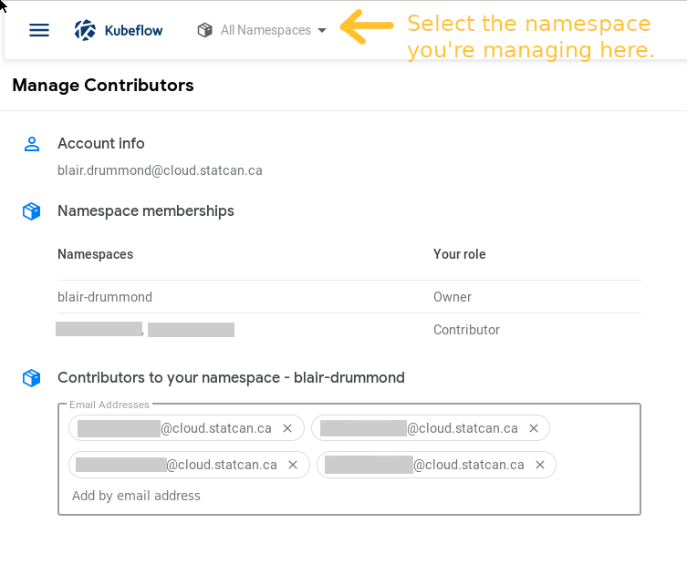

# Aperçu

Par défaut, chaque personne a son  espace de nom personnel, `prénom-nom`. Si vous souhaitez collaborer avec votre équipe, vous pouvez [demander un Espace de nom](./Demander-EspaceDeNom.md) à [partager](Aperçu.md#partager-le-calcul-espace-de-nom-dans-kubeflow).

# Installation

## Demander un espace de nom

Pour créer un espace de noms pour une équipe, accédez au portail ETAA. **Cliquez sur le &#8942; menu sur [la section Kubeflow du portail](https://www.statcan.gc.ca/services-analyse-donnees/etaa)**.

Entrez le nom que vous demandez et soumettez la demande. Veillez à n'utiliser que lettres minuscules plus tirets. 

<!-- prettier-ignore -->
!!! avertissement "L'espace de noms ne peut pas avoir de caractères spéciaux autres que des traits d'union"
    Le nom de l'espace de noms ne doit être composé que de lettres minuscules « a-z » avec des tirets. Sinon,l'espace de noms ne sera pas créé.

**Vous recevrez une notification par e-mail lorsque l'espace de noms sera créé.** Une fois l'espace de noms partagé créé, vous pouvez y accéder de la même manière que n'importe quel autre espace de noms dont vous disposez via l'interface utilisateur de Kubeflow, comme illustré ci-dessous. Vous serez alors capable de [partager et gérer](Aperçu.md#partager-le-calcul-espace-de-nom-dans-kubeflow)) à votre espace de nom.

Pour changer d'espace de noms, jetez un œil en haut de votre fenêtre, juste à droite du logo Kubeflow.

