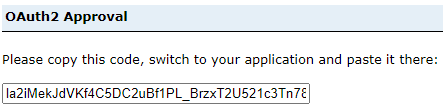

# Environnement d'Analyse Géospatiale (EAG) - Accès multi-plateforme

<!-- prettier-ignore -->
??? danger "Données non protégées uniquement, SSI bientôt disponible!"
    À l'heure actuelle, notre serveur géospatial ne peut héberger et donner accès qu'à des informations statistiques non sensibles.  
	
## Démarrage

<!-- prettier-ignore -->
!!! success "Conditions préalables"
    
    1. Un projet intégré avec accès au portail DAS EAG ArcGIS
    2. Un identifiant client ArcGIS Portal (clé API)

Le portail ArcGIS Enterprise est accessible dans AAW ou CAE à l'aide de l'API, à partir de n'importe quel service qui exploite le langage de programmation Python. 

Par exemple, dans AAW et l'utilisation de [Jupyter Notebooks](https://statcan.github.io/daaas/en/1-Experiments/Jupyter/) dans l'espace, ou pour CAE l'utilisation de [Databricks](https://statcan.github.io/cae-eac/en/DataBricks/), DataFactory, etc.

[Le portail DAS GAE ArcGIS Enterprise est accessible directement ici](https://geoanalytics.cloud.statcan.ca/portal)

[Pour obtenir de l'aide sur l'auto-inscription en tant qu'utilisateur du portail géospatial DAS](https://statcan.github.io/daaas-dads-geo/english/portal/)

<hr>

## Utilisation de l'API ArcGIS pour Python

### Connexion à ArcGIS Enterprise Portal à l'aide de l'API ArcGIS

1. Installez les packages :

	```python
	conda install -c esri arcgis
	```

	ou utilisez Artifactory

	```python3333
	conda install -c https://jfrog.aaw.cloud.statcan.ca/artifactory/api/conda/esri-remote arcgis
	```

2. Importez les librairies nécessaires dont vous aurez besoin dans le Notebook.
	```python
	from arcgis.gis import GIS
	from arcgis.gis import Item
	```
	
3. Accéder au portail
   Votre groupe de projet recevra un identifiant client lors de l'intégration. Collez l'ID client entre les guillemets```client_id='######'```. 
	
	```python
	gis = GIS("https://geoanalytics.cloud.statcan.ca/portal", client_id=' ')
	print("Successfully logged in as: " + gis.properties.user.username)
	```

4. - La sortie vous redirigera vers un portail de connexion.
   - Utilisez l'option de connexion Azure de StatCan et votre identifiant Cloud
   - Après une connexion réussie, vous recevrez un code pour vous connecter en utilisant SAML.
   - Collez ce code dans la sortie.

	

<hr>

### Afficher les informations utilisateur
En utilisant la fonction "me", nous pouvons afficher diverses informations sur l'utilisateur connecté.
```python
me = gis.users.me
username = me.username
description = me.description
display(me)
```

<hr>

### Rechercher du contenu
Recherchez le contenu que vous avez hébergé sur le portail géo DAaaS. En utilisant la fonction "me", nous pouvons rechercher tout le contenu hébergé sur le compte. Il existe plusieurs façons de rechercher du contenu. Deux méthodes différentes sont décrites ci-dessous.

**Recherchez tous vos éléments hébergés dans le portail géographique DAaaS.**
```python
my_content = me.items()
my_content
```
**Recherchez du contenu spécifique que vous possédez dans le portail géographique DAaaS.**

Ceci est similaire à l'exemple ci-dessus, mais si vous connaissez le titre de la couche que vous souhaitez utiliser, vous pouvez l'enregistrer en tant que fonction.
```python
my_items = me.items()
for items in my_items:
    print(items.title, " | ", items.type)
    if items.title == "Flood in Sorel-Tracy":
        flood_item = items
        
    else:
        continue
print(flood_item)
```

**Recherchez tout le contenu auquel vous avez accès, pas seulement le vôtre.**

```python
flood_item = gis.content.search("tags: flood", item_type ="Feature Service")
flood_item
```

<hr>

### Obtenir du contenu
Nous devons obtenir l'élément du portail géographique DAaaS afin de l'utiliser dans le bloc-notes Jupyter. Cela se fait en fournissant le numéro d'identification unique de l'article que vous souhaitez utiliser. Trois exemples sont décrits ci-dessous, tous accédant à la même couche.
```python
item1 = gis.content.get(my_content[5].id) #from searching your content above
display(item1)

item2 = gis.content.get(flood_item.id) #from example above -searching for specific content
display(item2)

item3 = gis.content.get('edebfe03764b497f90cda5f0bfe727e2') #the actual content id number
display(item3)
```

<hr>

### Effectuer une analyse
Une fois les couches importées dans le bloc-notes Jupyter, nous sommes en mesure d'effectuer des types d'analyse similaires à ceux que vous vous attendriez à trouver dans un logiciel SIG tel qu'ArcGIS. Il existe de nombreux modules contenant de nombreux sous-modules qui peuvent effectuer plusieurs types d'analyses.
<br/>

À l'aide du module arcgis.features, importez le sous-module use_proximity ```from arcgis.features import use_proximity```. Ce sous-module nous permet de `.create_buffers` - des zones à égale distance des entités. Ici, nous spécifions la couche que nous voulons utiliser, la distance, les unités et le nom de sortie (vous pouvez également spécifier d'autres caractéristiques telles que le champ, le type d'anneau, le type de fin et autres). En spécifiant un nom de sortie, après avoir exécuté la commande buffer, une nouvelle couche sera automatiquement téléchargée dans le portail DAaaS GEO contenant la nouvelle fonctionnalité que vous venez de créer.
<br/>

```python
buffer_lyr = use_proximity.create_buffers(item1, distances=[1], 
                                          units = "Kilometers", 
                                          output_name='item1_buffer')

display(item1_buffer)
```

Certains utilisateurs préfèrent travailler avec des packages Open Source. La traduction d'ArcGIS vers Spatial Dataframes est simple.
```python
# create a Spatially Enabled DataFrame object
sdf = pd.DataFrame.spatial.from_layer(feature_layer)
```

<hr>

### Mettre à jour les éléments
En obtenant l'élément comme nous l'avons fait similaire à l'exemple ci-dessus, nous pouvons utiliser la fonction `.update` pour mettre à jour l'élément existant dans le portail DAaaS GEO. Nous pouvons mettre à jour les propriétés, les données, les vignettes et les métadonnées des éléments.
```python
item1_buffer = gis.content.get('c60c7e57bdb846dnbd7c8226c80414d2')
item1_buffer.update(item_properties={'title': 'Enter Title'
									 'tags': 'tag1, tag2, tag3, tag4',
                                     'description': 'Enter description of item'}
```

<hr>

### Visualisez vos données sur une carte interactive

**Exemple : Librairie MatplotLib**
Dans le code ci-dessous, nous créons un objet ax, qui est un tracé de style carte. Nous traçons ensuite notre colonne de changement de données ("Population Change") sur les axes
```python
import matplotlib.pyplot as plt
ax = sdf.boundary.plot(figsize=(10, 5))
shape.plot(ax=ax, column='Population Change', legend=True)
plt.show()
```

**Exemple : librairie ipyleaflet**
Dans cet exemple, nous utiliserons la librairie 'ipyleaflet' pour créer une carte interactive. Cette carte sera centrée autour de Toronto, ON. Les données utilisées seront décrites ci-dessous.
Commencez par coller ```conda install -c conda-forge ipyleaflet``` vous permettant d'installer les librairies ipyleaflet dans l'environnement Python.
<br/>
Import the necessary libraries.
```python
import ipyleaflet 
from ipyleaflet import *
```
Maintenant que nous avons importé le module ipyleaflet, nous pouvons créer une carte simple en spécifiant la latitude et la longitude de l'emplacement que nous voulons, le niveau de zoom et le fond de carte [(plus de fonds de carte)](https://ipyleaflet.readthedocs.io/en /latest/map_and_basemaps/basemaps.html). Des contrôles supplémentaires ont été ajoutés tels que les calques et l'échelle.
```python
toronto_map = Map(center=[43.69, -79.35], zoom=11, basemap=basemaps.Esri.WorldStreetMap)

toronto_map.add_control(LayersControl(position='topright'))
toronto_map.add_control(ScaleControl(position='bottomleft'))
toronto_map
```
<br/>

##En savoir plus sur l'API ArcGIS pour Python
[La documentation complète de l'API ArcGIS peut être trouvée ici](https://developers.arcgis.com/python/)

##En savoir plus sur l'environnement analytique géospatial (GAE) et les services DAS
[Guide d'aide GAE](https://statcan.github.io/daaas-dads-geo/)
