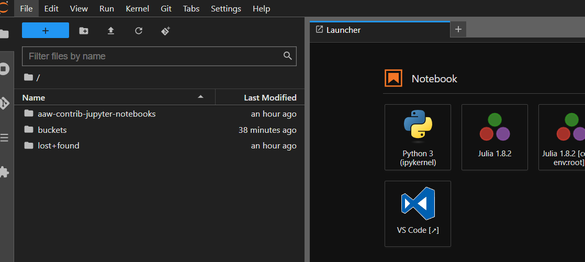
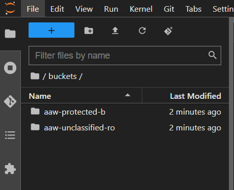

# Stockage Blob Azure (Conteneurs)

[Azure Blob Storage](https://learn.microsoft.com/en-us/azure/storage/blobs/storage-blobs-introduction) est la solution de stockage d'objets de Microsoft pour le cloud. Blob Storage est optimisé pour stocker des quantités massives de données non structurées. Les données non structurées sont des données qui n'adhèrent pas à un modèle de données ou à une définition particulière, comme du texte ou des données binaires.

Les conteneurs de stockage Azure Blob présentent les avantages suivants par rapport aux volumes Kubeflow (disques) :

1. **Capacité :** Les conteneurs peuvent être énormes : bien plus gros que les disques durs. Et ils sont toujours rapides.
2. **Simultanéité :** Vous pouvez accéder simultanément à la même source de données à partir de plusieurs serveurs de bloc-note et pipelines sans avoir besoin de dupliquer les données.
3. **Partage :** les espaces de noms de projet peuvent partager un conteneur. C'est idéal pour partager des données avec des personnes extérieures à votre espace de travail.
  
<!-- plus joli-ignorer -->
!!! avertissement "Les conteneurs et les compartiments Azure Blob Storage ont remplacé le stockage et les compartiments MinIO."
     Les utilisateurs seront responsables de la migration des données des compartiments MinIO vers les dossiers Azure Storage. [Cliquez ici pour obtenir des instructions sur la façon de migrer !](#how-to-migrate-from-minio-to-azure-blob-storage). Pour les fichiers plus volumineux, les utilisateurs peuvent [contacter AAW pour obtenir de l'aide](https://statcan-aaw.slack.com).

## Installation

### Accès au conteneur Blob depuis JupyterLab

Les volumes Blob CSI sont conservés sous « ~/buckets » lors de la création d'un serveur bloc-note. Les fichiers sous « ~/buckets » sont sauvegardés par le stockage Blob. Tous les ordinateurs portables AAW auront le « ~/buckets » monté sur le système de fichiers, rendant les données accessibles de partout.

Ces dossiers peuvent être utilisés comme n'importe quel autre : vous pouvez copier des fichiers vers/depuis l'explorateur de fichiers, écrire depuis Python/R, etc. La seule différence est que les données sont stockées dans le conteneur de stockage Blob plutôt que sur un disque local. (et est donc accessible partout où vous pouvez accéder à votre bloc-note Kubeflow).



#### Conteneurs non classés

Les conteneurs de stockage d'objets blob non classés apparaîtront comme suit dans le dossier « ~/buckets ».


#### Conteneurs B protégés

Les conteneurs de stockage de blob B protégés apparaîtront comme suit dans le dossier « ~/buckets ».



### Types de conteneurs

Les conteneurs Blob suivants sont disponibles. L’accès à tous les conteneurs Blob est le même. La différence entre les conteneurs réside dans le type de stockage qui les sous-tend :

- **aaw-unclassified :** Par défaut, utilisez celui-ci pour stocker des données non classifiées.
- **aaw-protected-b :** Utilisez celui-ci pour stocker des données sensibles protégées B.
- **aaw-unclassified-ro :** Cette classification est Protégé B mais accès en lecture seule. Cela permet aux utilisateurs de visualiser les données non classifiées dans un bloc-notes Protégé B.

### Accès aux données internes

L'accès aux données internes utilise la connexion de stockage commune DAS qui est utilisée par les utilisateurs internes et externes qui ont besoin d'accéder à des données non classifiées ou protégées B. Les conteneurs suivants peuvent être provisionnés :

- **externe-non classifié :** Non classifié et accessible aux employés de StatCan et non-Statcan.
- **external-protected-b :** Protégé B et accessible aux employés de StatCan et aux non-employés de StatCan.
- **interne-non classifié :** Non classifié et accessible uniquement aux employés de Statcan.
- **interne-protected-b :** Protégé B et accessible uniquement aux employés de StatCan.

Les conteneurs ci-dessus suivent la même convention que les conteneurs AAW en termes de données, mais il existe une couche d'isolement entre les employés de StatCan et les non-employés de StatCan. Les employés non-Statcan ne sont autorisés que dans les conteneurs **externes**, tandis que les employés de StatCan peuvent avoir accès à n'importe quel conteneur.

AAW dispose d'une intégration avec l'équipe FAIR Data Infrastructure qui permet aux utilisateurs de transférer des données non classifiées et protégées B vers des comptes de stockage Azure, permettant ainsi aux utilisateurs d'accéder à ces données à partir de serveurs bloc-note.

Veuillez contacter l'équipe FAIR Data Infrastructure si vous avez un cas d'utilisation de ces données.

## Tarifs

<!-- plus joli-ignorer -->
!!! info "Les modèles de tarification sont basés sur l'utilisation du processeur et de la mémoire"
     Le prix est couvert par KubeCost pour les espaces de noms utilisateur (dans Kubeflow en bas de l'onglet bloc-notes).

En général, le stockage Blob est beaucoup moins cher que [Azure Manage Disks](https://azure.microsoft.com/en-us/pricing/details/managed-disks/) et offre de meilleures E/S que les SSD gérés.

## L'explorateur de stockage Azure

Nos amis de Collaborative Analytics Environment (CAE) disposent de documentation sur l'accès à votre stockage Azure Blob à partir de votre AVD à l'aide de [Azure Storage Explorer](https://statcan.github.io/cae-eac/en/AzureStorageExplorer/). .

## Comment migrer de MinIO vers Azure Blob Storage

Tout d'abord, `source` les variables d'environnement stockées dans votre coffre-fort de secrets. Vous `source` soit à partir de **minio-gateway**, soit de **fdi-gateway** selon l'endroit où vos données ont été ingérées :

```
source /vault/secrets/fdi-gateway-protected-b
```

Ensuite vous créez un alias pour accéder à vos données :

```
mc alias set minio $MINIO_URL $MINIO_ACCESS_KEY $MINIO_SECRET_KEY
```

Listez le contenu de votre dossier de données avec `mc ls` :

```
mc ls minio
```

Enfin, copiez vos données MinIO dans votre répertoire Azure Blob Storage avec `mc cp --recursive` :

```
mc cp --recursive minio ~/buckets/aaw-unclassified
```

Si vous disposez de données Protégé B, vous pouvez copier vos données dans le compartiment Protégé B :

```
mc cp --recursive minio ~/buckets/aaw-protected-b
```
