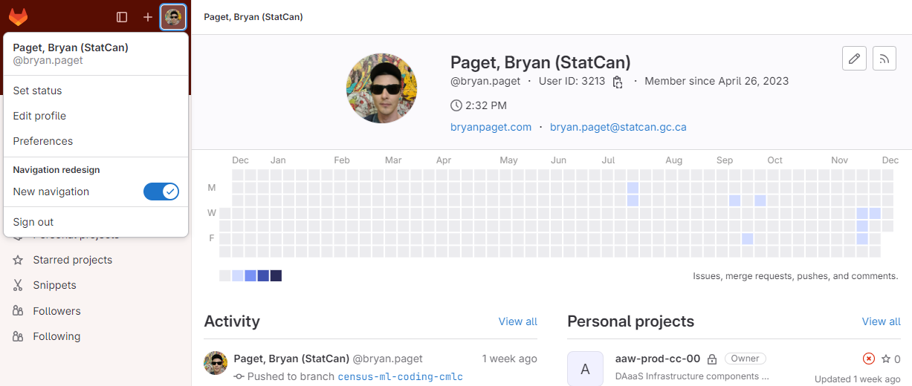
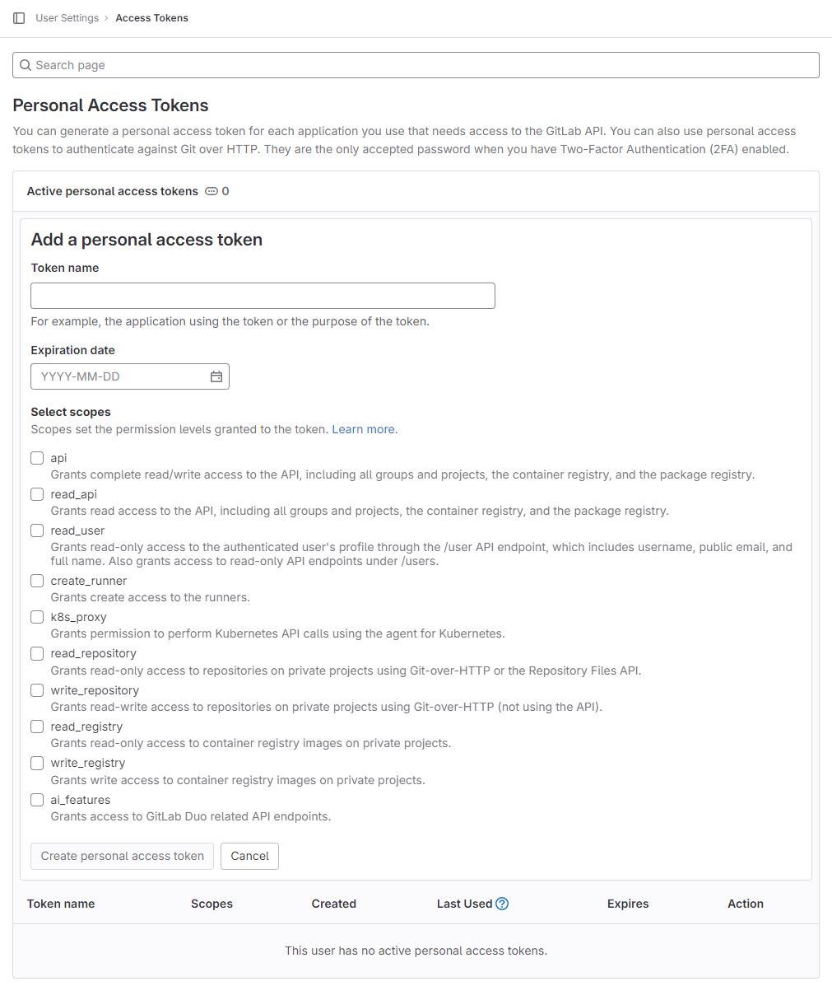
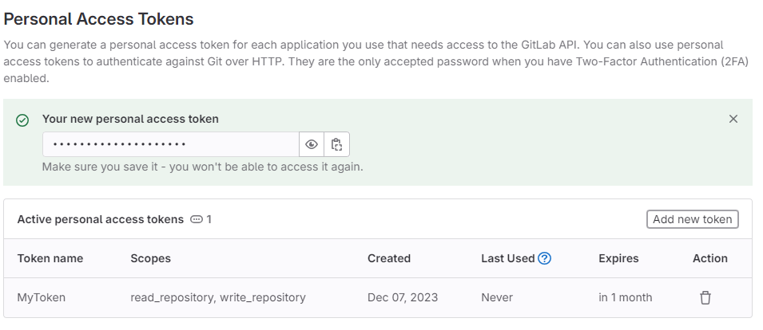

# Guide de configuration de GitLab

Bienvenue sur GitLab ! GitLab est une plateforme puissante qui facilite le développement collaboratif à l'aide de Git. Avant de plonger dans le monde des référentiels, assurons-nous que votre configuration Git correspond à votre identité GitLab. Vous trouverez ci-dessous des instructions sur la personnalisation de « git » et la création d'un jeton d'accès personnel (PAT) pour une interaction transparente avec les référentiels GitLab.

## Personnalisation de Git

Lorsque vous utilisez `git`, il est essentiel de configurer votre identité. Ouvrez une nouvelle session de terminal et exécutez les commandes suivantes pour configurer votre nom et votre adresse e-mail associés à GitLab :

### Nom d'utilisateur

```bash
git config --global user.name "Votre nom"
```

### E-mail

```bash
git config --global user.email "votreemail@votredomaine.com"
```

Désormais, chaque fois que vous interagissez avec GitLab, `git` utilisera ces informations pour vous identifier.

## Créer un jeton d'accès personnel (PAT)

Pour interagir (push, pull) avec n'importe quel référentiel GitLab de Statistique Canada, vous devez créer un jeton d'accès personnel. Suivez ces étapes:

1. [Allez sur GitLab](https://gitlab.k8s.cloud.statcan.ca/).
2. Cliquez sur votre **icône de profil** dans le coin supérieur gauche.
3. Sélectionnez **Préférences**, puis **Jetons d'accès**.

### Icône de profil



### Jetons d'accès


### Formulaire de jeton d'accès personnel



- Remplissez le formulaire en fournissant un nom pour le jeton (pour une identification facile), en définissant la date d'expiration du jeton et en accordant des autorisations (par exemple, `read_repository` et `write_repository`).
- Le token expire à cette date à minuit UTC.
- Si vous ne saisissez pas de date d'expiration, la date d'expiration est automatiquement fixée à 365 jours après la date du jour.
- Par défaut, cette date peut être postérieure au maximum de 365 jours à la date du jour.

### Le jeton

<!-- prettier-ignore -->
!!! warning "Gardez vos secrets pour vous!"
     1. Veuillez NE PAS stocker votre jeton d'accès personnel _n'importe où_ dans le système de fichiers de votre serveur d'espace de travail. Les contributeurs à un espace de noms y auront accès !
     2. S'il y a un contributeur externe à Statistique Canada dans votre espace de noms, vous perdrez l'accès à l'accès principal au cloud GitLab !



Le jeton généré pourra être copié en haut après avoir cliqué sur **Créer un jeton d'accès personnel**. Copiez et enregistrez ce jeton en toute sécurité, car il ne pourra pas être récupéré ultérieurement.

## Fournissez le jeton généré comme mot de passe GitLab

Utilisez le jeton généré comme mot de passe GitLab lorsque vous y êtes invité. Voici un exemple de la façon d'incorporer le jeton dans vos commandes :


Nous pouvons utiliser git-credential-cache pour mettre en cache notre nom d'utilisateur et notre mot de passe pendant une période donnée. Entrez simplement ce qui suit dans votre CLI (terminal ou invite de commande) :

``` bash
git config --global credential.helper cache
```

Vous pouvez également définir le délai d'attente (en secondes) comme tel :

``` bash
git config --global credential.helper 'cache --timeout=3600'

```

Pour plus d'informations sur les jetons d'accès personnels Gitlab, veuillez visiter : [la documentation officielle](https://docs.gitlab.com/ee/user/profile/personal_access_tokens.html). Avec ces étapes, vous êtes désormais prêt à collaborer de manière transparente sur GitLab ! Bon codage !
