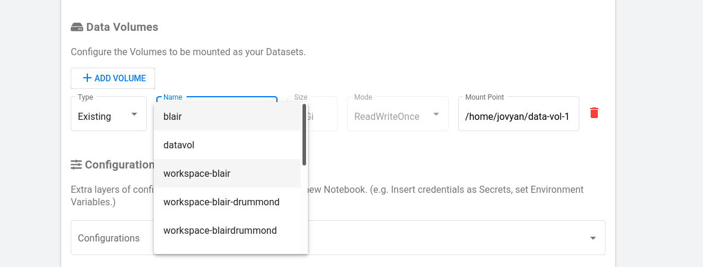
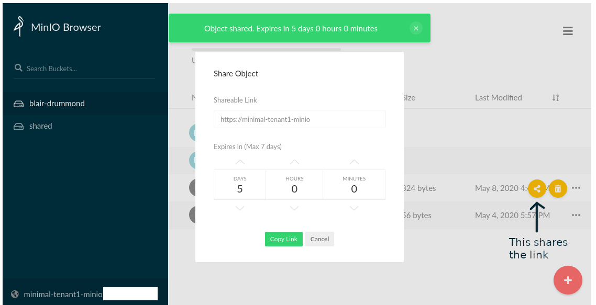

# Stockage

La plateforme propose différents types de stockage, conçus pour différents types
de cas d'utilisation. Par conséquent, cette section vous concerne, que vous
soyez en train d'expérimenter, de créer des pipelines, ou d'éditer.

En surface, il existe deux types de stockage :

- des disques (aussi appelés volumes)
- des compartiments (stockage S3 ou « blob »)

## Disques

Les disques sont les systèmes de fichiers courants de type disque dur ou SSD.
Vous pouvez monter les disques dans votre serveur Kubeflow, et même si vous
supprimez votre serveur, vous pouvez remonter les disques, car ils ne sont
jamais détruits par défaut. C'est un moyen très simple de stocker vos données,
et si vous partagez un espace de travail avec une équipe, tous les membres
peuvent utiliser le disque du même serveur (comme un lecteur partagé).



C'est un moyen très simple de stocker vos données. Si vous partagez un espace de
travail avec une équipe, tous les membres peuvent utiliser le disque du même
serveur comme un lecteur partagé.

## Compartiments


Les compartiments sont un peu plus compliqués, mais ils présentent trois
avantages :

- Le stockage de grandes quantités de données

  - Les compartiments peuvent être énormes (bien plus grands que les disques
    durs), et ils sont rapides.

- Le partage de données

  - Vous pouvez partager des fichiers à partir d'un compartiment en partageant
    une URL que vous pouvez obtenir par l'intermédiaire d'une interface Web
    simple. C'est une excellente façon de partager des données avec des
    personnes à l'extérieur de votre espace de travail.

- L'accès à la programmation

  - Plus important encore, il est beaucoup plus facile pour les pipelines et les
    navigateurs Web d'accéder aux données provenant de compartiments que d'un
    disque dur. Donc, si vous voulez utiliser des pipelines, il faut d'abord les
    configurer pour qu'ils fonctionnent avec un compartiment.

# Stockage en compartiment

Nous disposons de trois types de stockage en compartiment.

**Libre-service :**

- **[Minimal](https://minimal-tenant1-minio.covid.cloud.statcan.ca) :**  
  Par défaut, utilisez celui-ci. Il s’agit d’un stockage sur disque dur.
- **[Premium](https://premium-tenant1-minio.covid.cloud.statcan.ca) :**  
  Utilisez celui-ci si vous avez besoin de vitesses de lecture et d’écriture
  très élevées, comme pour les modèles d’entraînement sur de très grands
  ensembles de données.

**Disponible au grand public :**

- [Public (en lecture seule)](https://datasets.covid.cloud.statcan.ca)

## Libre-service

Dans chacune des trois options de libre-service, vous pouvez créer un
compartiment personnel. Pour ouvrir une session, il vous suffit d’utiliser
l’option **OpenID** comme ci-dessous.


Une fois que vous êtes connecté, vous pouvez créer un compartiment personnel
selon le format `firstname-lastname`.


## Partage

Vous pouvez facilement partager des fichiers individuels. Il suffit d’utiliser
l’option "share" pour un fichier particulier, et vous obtiendrez un lien que
vous pourrez envoyer à un collaborateur.



## Accès à la programmation

Nous travaillons actuellement à vous donner l’accès à votre stockage en
compartiment par l’entremise d’un dossier dans votre bloc-notes. En attendant
que cela soit possible, vous pouvez y accéder par programme en utilisant l’outil
de ligne de commande `mc` ou au moyen des appels d’API S3 dans R ou Python.

<!-- prettier-ignore -->
!!! danger "Configuration Kuberflow requise"
    Si vous souhaitez activer le stockage en compartiment de votre bloc-notes, sélectionnez "Inject
    credentials to access MinIO object storage" dans le menu **Configurations**
    lorsque vous créez votre serveur. Sinon, votre serveur ne saura pas comment
    se connecter à votre stockage personnel.
    

<!-- prettier-ignore -->
!!! conseil "Voir les exemples de blocs-notes."
    Dans `jupyter-notebooks/self-serve-storage`, vous trouverez un modèle pour vous connecter dans `R` ou `Python`, ou par
    la ligne de commande fournie. Vous pouvez
    copier-coller et modifier ces exemples. Ils devraient répondre à la plupart de vos besoins.

### Connexion à l’aide de `mc`

Pour vous connecter, il suffit d’exécuter ce qui suit (remplacer
`FULLNAME=blair-drummond` par votre `firstname-lastname` réel) :

```sh
#!/bin/sh

FULLNAME=blair-drummond

# Obtenir les justificatifs d’identité
source /vault/secrets/minio-minimal-tenant1

# Ajouter le stockage sous le pseudonyme "minio-minimal"
mc config host add minio-minimal $MINIO_URL $MINIO_ACCESS_KEY $MINIO_SECRET_KEY

# Créer un compartiment à votre nom
# REMARQUE : Vous pouvez *uniquement* créer des compartiments nommés avec votre PRÉNOM-NOMDEFAMILLE. Tout
# autre nom sera rejeté.

# Compartiment privé ("mb" = "make bucket")
mc mb minio-minimal/${FULLNAME}

# Compartiment partagé
mc mb minio-minimal/shared/${FULLNAME}

# Voilà! Vous pouvez maintenant copier des fichiers ou des dossiers.
[ -f test.txt ] || echo "Ceci est un test" > test.txt
mc cp test.txt minio-minimal/${FULLNAME}/test.txt
```

Ouvrez maintenant le
[navigateur MinIO](https://minimal-tenant1-minio.covid.cloud.statcan.ca) et vous
y verrez votre fichier de test.

Vous pouvez utiliser `mc` pour copier des fichiers vers le compartiment ou à
partir du compartiment. Cette opération est très rapide. Vous pouvez également
utiliser `mc --help` pour voir les autres options qui s’offrent à vous, comme
`mc ls minio-minimal/FIRSTNAME-LASTNAME/` pour afficher le contenu de votre
compartiment.

<!-- prettier-ignore -->
??? conseil "Autres options de stockage"
    Pour utiliser l’une de nos autres options de stockage, `pachyderm` ou `premium`, il vous suffit de
    remplacer `minimal` dans le programme ci-dessus par le type dont vous avez besoin.
