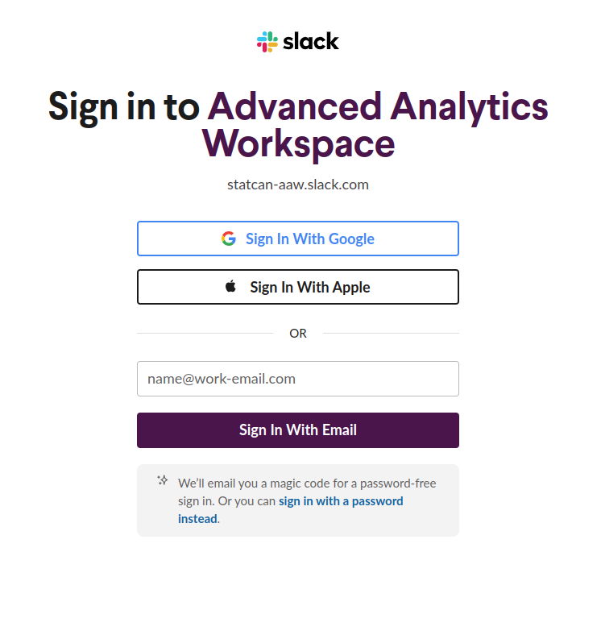

# Bienvenue dans l'espace de travail d'analyse avancée

## La documentation de l'espace de travail d'analyse avancée

_Bienvenue dans le monde de la science des données et de l'apprentissage automatique !_

<!-- prettier-ignore -->
!!! info "Qu'est-ce que l'ETAA?"
     **[Espace de travail d'analyse avancée](https://www.statcan.gc.ca/services-analyse-donnees/etaa)** est une plateforme open source conçue pour les data scientists, les intendants des données, les analystes et les chercheurs familiarisés avec les outils open source et le codage. Développé par des data scientists pour des data scientists, ETAA fournit un environnement flexible qui permet aux praticiens avancés de faire leur travail en toute simplicité.

L'ETAA est une solution complète pour la science des données et l'analyse des données. Avec l'ETAA, vous pouvez personnaliser les déploiements de serveurs de bloc-notes en fonction de vos besoins spécifiques en science des données. Nous avons un petit nombre d'images Docker personnalisées réalisées par notre équipe.

<!-- prettier-ignore -->
!!! info "Qu'est-ce que Kubeflow ?"
     L'ETAA est basé sur [Kubeflow](https://www.kubeflow.org/), une solution complète open source pour le déploiement et la gestion de flux de travail ML de bout en bout.

Que vous débutiez ou que vous soyez déjà à fond dans l'analyse des données, l'espace de travail Advanced Analytics a tout ce dont vous avez besoin pour faire passer votre travail au niveau supérieur. Des outils puissants pour les pipelines de données au stockage en nuage pour vos ensembles de données, notre plateforme a tout pour plaire. Besoin de collaborer avec des collègues ou de publier vos résultats ? Aucun problème. Nous offrons des fonctionnalités de collaboration transparentes qui facilitent la collaboration et le partage de votre travail avec d'autres.

Quelle que soit l'étape à laquelle vous vous trouvez dans votre parcours en science des données, l'espace de travail d'analyse avancée dispose des ressources dont vous avez besoin pour réussir.

## Premiers pas avec l'ETAA

### Le portail ETAA

La page d'accueil du portail ETAA est disponible uniquement pour les utilisateurs internes. Cependant, les utilisateurs externes disposant d'un compte cloud auquel le sponsor commercial a accordé l'accès peuvent accéder à la plate-forme via l'URL de la plate-forme d'analyse.

<!-- prettier-ignore -->
!!! info annoter "Page d'accueil du portail ETAA"
     - [**Page d'accueil du portail pour les employés de Statistique Canada**](https://www.statcan.gc.ca/services-analyse-donnees/etaa)
     - [**Page d'accueil du portail pour les utilisateurs externes**](https://www.statcan.gc.ca/services-analyse-donnees/apercu)

### Compte Kubeflow

<!-- prettier-ignore -->
!!! important "Attention Utilisateurs Externes!"
     Les utilisateurs externes à Statistique Canada auront besoin d'un compte cloud auquel l'entreprise commanditaire aura accès.

<!-- prettier-ignore -->
!!! important "A l'attention des employés de Statistique Canada!"
     Les utilisateurs internes de Statistique Canada peuvent commencer immédiatement sans aucune procédure d'inscription supplémentaire, il suffit de se rendre sur [https://kubeflow.ETAA.cloud.statcan.ca/](https://kubeflow.aaw.cloud.statcan.ca/).

<!-- prettier-ignore -->
!!! note ""
     

     
    <h3>**[👉 Cliquez ici pour configurer votre compte Kubeflow! 👈](https://kubeflow.aaw.cloud.statcan.ca/)**</h3>
     

**[Kubeflow](1-Experiments/Kubeflow/)** est une plate-forme open source puissante et flexible qui permet une exploitation dynamique du calcul dans le cloud, les utilisateurs ayant la possibilité de contrôler les ressources de calcul, de mémoire et de stockage utilisées.

Kubeflow simplifie les tâches suivantes :

- Création d'environnements personnalisables pour travailler avec des données avec un provisionnement de ressources contrôlé par l'utilisateur (CPU, GPU, RAM et stockage personnalisés).
- Gestion des serveurs d'ordinateurs portables, y compris Ubuntu Desktop (via noVNC), R Studio, JupyterLab avec Python, R, Julia et SAS pour les employés de Statistique Canada.

<!-- prettier-ignore -->
!!! info "Tableau de bord Kubeflow"
     - [**Kubeflow Dashboard**](https://kubeflow.aaw.cloud.statcan.ca/) Utilisez ce lien une fois que vous avez votre compte cloud !

La prise en main de l'espace de travail d'analyse avancée (ETAA) est simple et rapide. Tout d'abord, vous voudrez vous connecter à Kubeflow pour créer votre premier serveur de bloc-notes exécutant JupyterLab, RStudio ou Ubuntu Desktop. Nous vous encourageons à rejoindre notre chaîne Slack pour entrer en contact avec d'autres data scientists et analystes, poser des questions et partager vos expériences avec la plateforme ETAA.

### Slack

- **[Cliquez ici pour vous connecter à notre espace de travail d'assistance Slack](https://statcan-aaw.slack.com/)**

- **Utilisez la chaîne _Général_ !**

Chez Statistique Canada, nous comprenons que se lancer dans un nouveau projet peut être accablant, et vous aurez probablement de nombreuses questions liées à la plateforme en cours de route. C'est pourquoi nous avons créé un **[canal Slack](https://statcan-aaw.slack.com/)** dédié pour vous fournir l'assistance dont vous avez besoin. Notre équipe d'experts est là pour répondre à vos questions, répondre à vos préoccupations et vous guider à chaque étape du processus.

Pour rejoindre notre **[canal Slack](https://statcan-aaw.slack.com/)**, cliquez simplement sur le lien fourni et suivez les instructions. Vous serez invité à créer un compte dans le coin supérieur droit de la page. Si vous avez une adresse de courriel « @statcan.gc.ca », utilisez-la lors de votre inscription, car cela garantira que vous êtes automatiquement approuvé et que vous pouvez commencer à vous engager immédiatement avec notre communauté.

Une fois que vous avez créé votre compte, vous aurez accès à une multitude de ressources et d'informations, ainsi que la possibilité de vous connecter avec d'autres utilisateurs qui travaillent sur des projets similaires. Notre **[chaîne Slack](https://statcan-aaw.slack.com/)** est l'endroit idéal pour poser des questions, partager des idées et collaborer avec vos pairs en temps réel. Que vous commenciez tout juste à démarrer un nouveau projet ou que vous recherchiez des conseils d'experts sur un problème complexe, notre équipe est là pour vous aider.

Alors n'hésitez pas : rejoignez notre **[canal Slack](https://statcan-aaw.slack.com/)** dès aujourd'hui et commencez à obtenir les réponses dont vous avez besoin pour réussir. Nous sommes impatients de vous accueillir dans notre communauté !

Cliquez sur le lien, puis choisissez "Créer un compte" dans le coin supérieur droit.

<!-- prettier-ignore -->
!!! note ""
     

     
     <h3>Utilisez votre adresse de courriel @statcan.gc.ca afin que vous soyez automatiquement approuvé.</h3>
     

## 🧭 Mise en route

Pour accéder aux services ETAA, vous devez vous connecter à Kubeflow avec votre compte cloud invité de Statistique Canada. Une fois connecté, sélectionnez Notebook Servers et cliquez sur le bouton "Nouveau serveur" pour commencer.

1. Connectez-vous à [Kubeflow](https://kubeflow.aaw.cloud.statcan.ca/) avec votre compte cloud invité de Statistique Canada. Vous serez invité à authentifier le compte.
2. Sélectionnez Serveurs de bloc-notes.
3. Cliquez sur le bouton "➕ Nouveau serveur".

## 🧰 Outils Offerts

ETAA est une plate-forme flexible pour l'analyse de données et l'apprentissage automatique. Il propose une gamme de langages, notamment Python, R et Julia. ETAA prend également en charge les environnements de développement tels que VS Code, R Studio et Jupyter Notebooks. De plus, des bureaux virtuels Linux sont disponibles pour les utilisateurs qui ont besoin d'outils supplémentaires tels que OpenM++ et QGIS.

Voici une liste d'outils que nous proposons :

- 📜 Languages :
   - 🐍 Python
   - 📈 R
   - 👩‍🔬 Julia
- 🧮 Environnements de développement :
   - Code VS
   - Studio R
   - Cahiers Jupyter
- 🐧 Bureaux virtuels Linux pour des outils supplémentaires (🧫 OpenM++, 🌏 QGIS etc.)

Le partage de code, de disques et d'espaces de travail (ex : deux personnes partageant la même machine virtuelle) est décrit plus en détail dans la section [Collaboration](4-Collaboration/Aperçu.md). Le partage de données via des buckets est décrit plus en détail dans **[Azure Blob Storage](./5-Stockage/AzureBlobStorage.md)**
section.

### 💡 Aide

- Disque (également appelé Volumes sur l'écran de création de serveur bloc-notes)
- Conteneurs (Stockage Blob)
- Lacs de données (à venir)

- 📗 Documentation du portail ETAA
   - [https://statcan.github.io/aaw/](https://statcan.github.io/aaw/)
- 📘 Documentation Kubeflow
   - [https://www.kubeflow.org/docs/](https://www.kubeflow.org/docs/)
- 🤝 Canal d'assistance Slack
   - [https://statcan-etaa.slack.com](https://statcan-aaw.slack.com)

## 🐱 Démos

Si vous avez besoin d'une session de démonstration d'intégration rapide, avez besoin d'aide ou avez des questions, veuillez nous contacter via notre [🤝 Canal d'assistance Slack](https://statcan-aaw.slack.com).

## Contribuant

Si vous avez des bogues à signaler ou des fonctionnalités à demander, veuillez le faire via https://github.com/Statcan/daaas.
