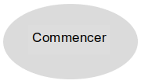
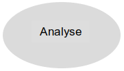
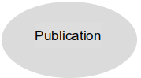
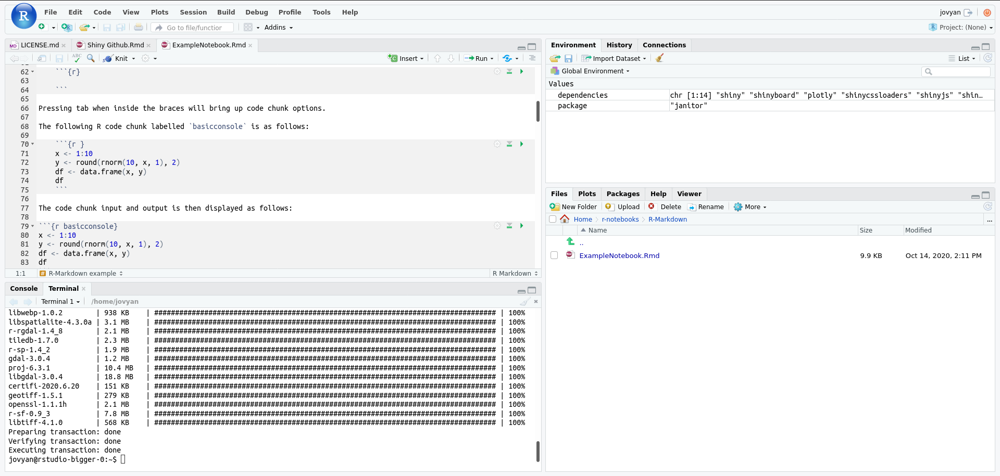
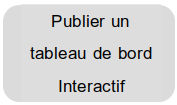
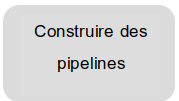

# Démarrer sur l'espace de travail d'analyse avancée

Le
**[portail de l'espace de travail d'analyse avancée](https://portal.covid.cloud.statcan.ca)**
est un excellent endroit où explorer les ressources dont il sera question ici,
et y accéder.

### Que cherchez-vous ?

# Démarrer avec AAW

Tout commence avec **[Kubeflow](1-Experiences/Kubeflow/)**! Commencez par le
configurer.

Vous allez avoir des questions. Rejoignez notre
**[Canal Slack](https://statcan-aaw.slack.com/)** pour que nous puissions vous
donner des réponses!

Cliquez sur le lien, puis choisissez "Créer un compte" dans le coin en haut à
droite.

Utilisez votre adresse électronique @canada.ca pour que votre demande soit
automatiquement approuvée.

# Expériences

## Traiter les données en utilisant les serveurs bloc-notes

Dans [Kubeflow](1-Experiences/Kubeflow/), les
**[Serveurs Bloc-Notes](1-Experiences/Jupyter.md)** vous permet d'obtenir un
environnement de calcul interactif pour traiter les données. Tous les serveurs
bloc-notes ont accès à un maximum de 15CPU/48GB RAM et à un stockage à l'échelle
de GB/TB, mais ont une interface utilisateur différente selon la version que
vous choisissez.

- Python, Julia et R via un **Bloc-notes Jupyter**.
- R via **RStudio**

### Bloc-notes Jupyter pour `Python`, `Julia`, ou `R`

Utilisez un [Bloc-notes Jupyter](https://jupyter.org/) pour créer et partager
des documents interactifs qui contiennent un mélange de code en direct, de
visualisations et de texte. Ceux-ci peuvent être écrits en `Python`,` Julia` ou
`R`.

Pour lancer un serveur bloc-notes avec une interface Jupyter, choisissez l'une
des images `jupyterlab` lors de la création de votre serveur bloc-notes. L'image
`jupyterlab` est également préchargée avec VS Code dans le navigateur si vous
préférez une expérience IDE complète.

### RStudio pour `R` et `Shiny`

**[RStudio](1-Experiences/RStudio.md)** vous offre un environnement de
développement intégré spécifiquement pour R. Si vous codez en R, c'est
typiquement le serveur bloc-notes à utiliser. Utilisez l'image `rstudio` pour
obtenir un environnement RStudio.

## Exécuter un bureau virtuel

Pour une expérience de bureau Ubuntu complète, utilisez l'un de nos serveurs
bloc-notes [`remote-desktop`](1-Experiences/Bureau-virtuel).Vous pouvez exécuter
un bureau Ubuntu complet, avec des applications typiques, directement dans votre
navigateur, en utilisant
[**Espace de travail ML**](1-Experiences/Bureau-virtuel.md)

# Publication

## Construire et publier un tableau de bord interactif

Utilisez **[R-Shiny](./2-Publication/R-Shiny.md)** pour créer des applications
web interactives directement à partir de R. Vous pouvez déployer votre tableau
de bord R-Shiny en soumettant une requête de tirage à notre
[dépôt GitHub R-Dashboards](https://github.com/StatCan/R-dashboards).

**[Dash](./2-Publication/Dash.md)** est un outil de visualisation de données qui
vous permet de construire une interface graphique interactive autour de votre
code d'analyse de données.

## Explorer vos données

Utilisez **[Datasette](./2-Publication/Datasette.md)** , une API JSON
instantanée pour vos bases de données SQLite. Exécutez des requêtes SQL d'une
manière plus interactive !

# Pipelines

## Créer et planifier des pipelines de données/analyse

**[Kubeflow Pipelines](./3-Pipelines/Kubeflow-Pipelines.md)** vous permet de
mettre en place des pipelines. Chaque pipelines encapsulent des flux de
production analytiques et peuvent être mis en commun, réutilisés et programmés.

## Intégration avec les offres de plateforme en tant que service (PaaS)

Nous pouvons nous intégrer à de nombreuses offres de Plateforme en tant que
Service (PaaS), telles que Databricks ou AzureML.

# Collaboration

## Partage du code

 Utilise GitHub
ou GitLab pour partager votre code avec les membres de votre équipe, ou demander
pour un **[espace de travail partagé](./Collaboration.md)** .

<!-- prettier-ignore -->
!!! info "Demander de l'aide pour la production"
    Le personnel de soutien de l'espace de travail d'analyse avancée est heureux
    de vous aider pour les cas d'utilisation orientés vers la production,
    et nous pouvons probablement vous faire gagner beaucoup de temps.
    N'hésitez pas à [nous demander pour de l'aide](Aide)!

# Comment obtenir des données? Comment envoyer des données?

- Chaque espace de travail peut être équipé de son propre stockage.

- Il existe également des compartiments de stockage pour la publication
  d'ensembles de données, pour usage interne ou diffusion plus large.

Nous donnerons un aperçu des technologies ici. Des renseignements plus précis
sur chacune d'entre elles seront fournis dans les sections suivantes.

<!-- prettier-ignore -->
!!! example "Parcourir quelques ensembles de données"
    Parcourez quelques [ensembles de données](https://datasets.covid.cloud.statcan.ca)
    ici. Ces ensembles de données ont été conçus pour stocker des données
    largement partagées. Il peut s'agir de données qui ont été introduites, ou
    de données qui seront diffusées sous forme de produit. **Comme toujours,
    veillez à ce qu'il ne s'agisse pas de données de nature délicate.**
