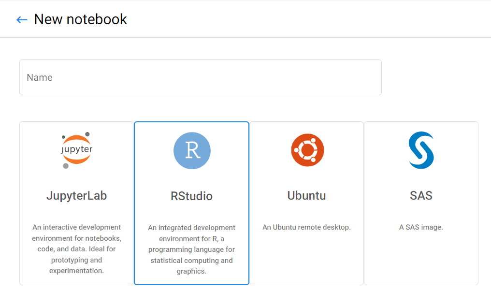

# Overview

RStudio is an integrated development environment (IDE) for R. It includes a console, editor, and tools for plotting, history, debugging and workspace management.

# Video Tutorial

# Setup

You can use the `rstudio` image to get an RStudio environment! When you create your notebook, choose RStudio from the list of available images.

You can install `R` or `python` packages with `conda` or `install.packages()`.

# Once you've got the basics ...

## R-Shiny

You can use `Shiny`, too! Shiny is an open source R package that provides a web
framework for building web applications using R. Shiny helps you turn your
analyses into interactive web applications.

### R Studio

_Process data using R or Python in R Studio_

R Studio is a powerful integrated development environment (IDE) that supports both the R and Python programming languages, making it an ideal choice for data analysts and scientists. With R Studio, you can perform a wide range of data processing tasks, from data cleaning and transformation to statistical analysis and machine learning. The software provides a user-friendly interface and a variety of tools and libraries that simplify complex data analysis tasks. In addition, R Studio makes it easy to share your work with others by creating dynamic, interactive reports and visualizations that can be published online or shared as standalone documents. Overall, R Studio is a versatile and powerful tool that is essential for anyone working with data in R or Python.

**[R Studio](../1-Experiments/RStudio.md)** gives you an integrated development environment for R and Python. Use the r-studio-cpu image to get an R Studio environment.

