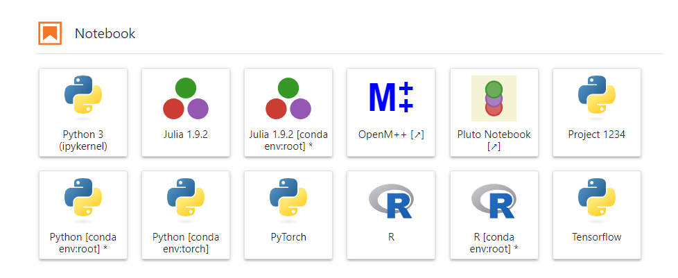

# Virtual Environments



When conducting data science experiments, it's a best practice to utilize Python and/or conda virtual environments to manage your project dependencies. It is common to create a dedicated environment for each project or, in some cases, separate environments for different features or aspects of your work (for instance, one environment for general projects and an additional environment tailored for GPU-accelerated deep learning tasks).

If you find yourself frequently switching between environments and desire a more convenient way to access them within JupyterLab, you can follow these instructions:

### Creating and Adding Environments to the JupyterLab Launcher

#### Step 1: Create the Environment

Open a terminal session and run the following code to create a new virtual environment. You can use either conda or python venv based on your preferences and project requirements. Each has its own advantages:

#### Using conda:

```bash
conda create -n torch
```

##### Advantages of conda:

- Manages both Python packages and environments.
- Simplifies package management, including non-Python libraries and dependencies.

#### Using venv:

```bash
python -m venv torch
```

##### Advantages of venv:

- Part of the Python standard library (no separate installation required).
- Provides a lightweight, Python-centric virtual environment.

#### Step 2: Add the Environment to the Launcher

After creating the environment, add it to the JupyterLab Launcher with the following command:

```bash
python -m ipykernel install --user --name "torch" --display-name "PyTorch"
```

- `--name "torch"` specifies the name of the kernel (replace "torch" as needed).
- `--display-name "PyTorch"` sets the display name for the kernel in the JupyterLab Launcher (customize as necessary).

#### Step 3: Refresh JupyterLab

To see the changes in the JupyterLab Launcher, refresh your browser by either clicking the refresh button or using the keyboard shortcut F5.

These steps enable you to seamlessly manage your Python environments and access them conveniently from the JupyterLab Launcher, fostering a more organized and efficient workflow for your data science experiments.
