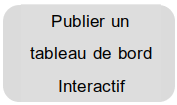

# Aperçu

R-Shiny est un package R qui facilite la création d'applications Web interactives dans R.

<!-- prettier-ignore -->
!!! info "Hébergement d'applications R Shiny"
     Nous ne prenons actuellement pas en charge l'hébergement d'applications R Shiny, mais vous pouvez les créer. Nous souhaitons activer l'hébergement de l'application R Shiny à l'avenir.


## R Shiny

_Publier des graphismes de qualité professionnelle_

<center>
[](../R-Shiny/)
</center>

R Shiny est un framework d'application Web open source qui permet aux scientifiques de données et aux analystes de créer des tableaux de bord et des visualisations de données interactifs basés sur le Web à l'aide du langage de programmation R. L'un des principaux avantages de R Shiny est qu'il offre un moyen simple de créer des tableaux de bord interactifs de haute qualité sans avoir besoin d'une expertise approfondie en développement Web. Avec R Shiny, les scientifiques de données peuvent tirer parti de leurs compétences en codage R pour créer des applications Web dynamiques, basées sur les données, qui peuvent être facilement partagées avec les acteurs.

Un autre avantage de R Shiny est qu'il prend en charge une variété de visualisations de données qui peuvent être facilement personnalisées pour répondre aux besoins du projet. Les utilisateurs peuvent créer une large gamme de diagrammes et de graphiques, allant de simples diagrammes à barres et nuages de points à des cartes thermiques et des graphiques de réseau plus complexes. De plus, R Shiny prend en charge une variété de widgets interactifs qui permettent aux utilisateurs de manipuler et d'explorer des données en temps réel.


R Shiny est également hautement extensible et peut être intégré à d'autres outils et plates-formes open source pour créer des workflows de science des données de bout en bout. Avec ses fonctionnalités puissantes et flexibles, R Shiny est un choix populaire pour créer des tableaux de bord de visualisation de données pour un large éventail d'applications, de la recherche scientifique à l'analyse commerciale. Dans l'ensemble, R Shiny offre une solution puissante, personnalisable et rentable pour créer des tableaux de bord interactifs et des visualisations de données.

Utilisez **[R-Shiny](../R-Shiny/)** pour créer des applications Web interactives directement à partir de R. Vous pouvez déployer votre tableau de bord R Shiny en soumettant une demande d'extraction à notre [Référentiel R-Dashboards GitHub ](https://github.com/StatCan/R-dashboards).

#  Éditeur d'interface utilisateur R Shiny

Le script Rscript suivant installe les packages requis pour exécuter "shinyuieditor" sur l'ETAA. Il commence par installer les packages R nécessaires et utilise `conda` pour installer `yarn`.

Une fois l'installation terminée, vous pouvez accéder au code de votre application dans `./my-app`

Exécutez ce script depuis `rstudio`. RStudio peut demander la permission d'ouvrir une nouvelle fenêtre si vous avez un bloqueur de popup.

``` r title="setup-shinyuieditor.R" linenums="1"
#!/usr/bin/env Rscript

#' Installer les packages nécessaires
install.packages(c(
  "shiny",
  "plotly",
  "gridlayout",
  "bslib",
  "remotes",
  "rstudioapi"
))

#' n'a pas été installé lors de l'installation ci-dessus
install.packages("DT")

#' Cela installe shinyuieditor de Github
remotes::install_github("rstudio/shinyuieditor", upgrade = F)

#' Nous avons besoin de fil donc nous allons l'installer avec conda
system("conda install yarn", wait = T)

#' Ceci clone Shinyuieditor et un exemple d'application de Github
system("git clone https://github.com/rstudio/shinyuieditor", wait = T)

#' Copiez l'application des vignettes vers notre répertoire de travail actuel
system("cp -R ./shinyuieditor/vignettes/demo-app/ ./my-app")

#' Définit le répertoire de travail actuel sur le répertoire racine de l'application
setwd("./my-app")

#' Yarn va mettre en place notre projet
system("yarn install", wait = T)

#' Chargez et lancez shinyuieditor
library(shinyuieditor)
shinyuieditor::launch_editor(app_loc = "./")
```

### Choisissez un modèle d'application

La première chose que vous verrez est le sélecteur de modèle. Il existe trois options au moment d'écrire ces lignes (`shinyuieditor` est actuellement en alpha).


### Mode fichier unique ou multi

Je recommande le **mode multi-fichiers**, cela mettra le code back-end dans un fichier appelé `server.R` et le front-end dans un fichier appelé `ui.R`.


### Concevez votre application

Vous pouvez concevoir votre application avec du code ou l'interface utilisateur graphique. Essayez de concevoir la mise en page avec l'interface graphique et de concevoir les tracés avec du code.


Toutes les modifications que vous apportez dans `shinyuieditor` apparaîtront immédiatement dans le code.


Toute modification que vous apportez au code apparaîtra immédiatement dans le `shinyuieditor`.


## Publication sur l'ETAA

### Envoyez simplement une pull request !

Tout ce que vous avez à faire est d'envoyer une demande d'extraction à [notre référentiel R-Dashboards](https://github.com/StatCan/R-dashboards). Incluez votre référentiel dans un dossier avec le nom que vous voulez (par exemple, "air-quality-dashboard"). Ensuite, nous l'approuverons et il sera mis en ligne.

Si vous avez besoin d'installer des bibliothèques R supplémentaires, envoyez votre liste au [dépôt R-Shiny](https://github.com/StatCan/shiny) en créant un problème GitHub et nous ajouterons les dépendances.


<!-- prettier-ignore -->
!!! example "Voir le tableau de bord ci-dessus ici"
     Le tableau de bord ci-dessus est dans GitHub. Jetez un œil à [la source](https://github.com/StatCan/R-dashboards/tree/master/bus-dashboard).

## Une fois que vous avez les bases...

### Intégrer des tableaux de bord dans vos sites Web

<!-- prettier-ignore -->
!!! failure "Intégrer des tableaux de bord dans d'autres sites"
     Nous n'avons pas encore eu l'occasion de l'examiner ou de le prototyper, mais si vous avez un cas d'utilisation, n'hésitez pas à contacter l'ingénierie. Nous travaillerons avec vous pour trouver quelque chose.
