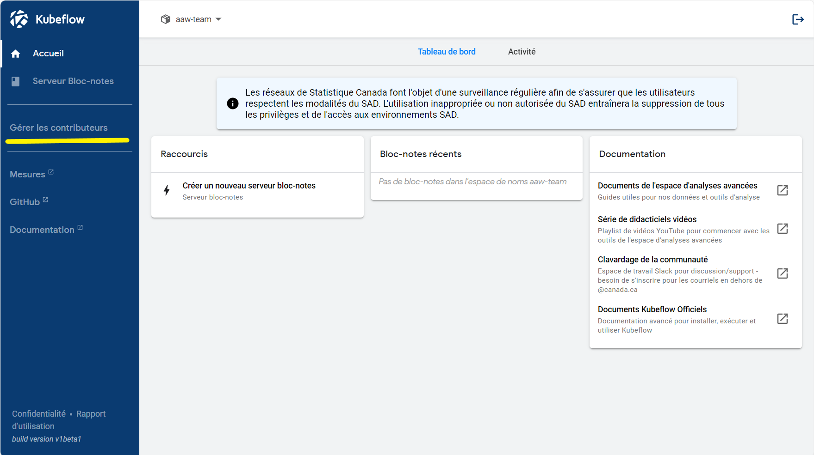

La collaboration est essentielle en science des données car elle permet à des individus ayant des perspectives et des parcours différents de travailler ensemble pour résoudre des problèmes complexes et générer de nouvelles informations. En science des données, la collaboration peut impliquer de travailler avec des personnes issues de divers domaines tels que les mathématiques, l’informatique et les affaires, ainsi qu’avec des experts en la matière possédant une connaissance approfondie d’une industrie ou d’un domaine particulier.

Il existe de nombreuses façons de collaborer sur la plateforme. Selon votre situation,ce qu vous voulez partager et le nombre de personnes que vous souhaitez partager avec. Les scénarios se décomposent en gros en ce que vous voulez partager (**Données**, **Code**, ou **Environnements de calcul** (e.g.: Partager les mêmes machines virtuelles)) et avec qui vous voulez le partager (**Personne**, **Mon équipe**, ou **Tout le monde**). Cela conduit au tableau d'options suivant:

|             |              **Privée**               |                          **Équipe**                          |     **StatCan**      |
| :---------: | :-----------------------------------: | :----------------------------------------------------------: | :------------------: |
|  **Code**   | GitLab/GitHub ou un dossier personnel |              GitLab/GitHub or dossier d'équipe               |    GitLab/GitHub     |
| **Données** |   Dossier personnel ou compartiment   | Dossier d'équipe ou compartiment , ou espace de noms partagé | Compartiment partagé |
| **Calcul**  |        Espace de nom personnel        |                    Espace de noms partagé                    |         N/A          |

Le partage de code, de disques et d'espaces de travail (par exemple : deux personnes partageant la même machine virtuelle) est décrit plus en détail ci-dessous. Le partage de données via des compartiments est décrit plus en détail dans la section **[Stockage Blob Azure](../5-Stockage/StockageBlobAzure.md)**.

<!-- prettier-ignore -->
??? question "Quelle est la différence entre un compartiment et un dossier?"
    Les compartiments sont comme le stockage sur réseau. Consulter [ présentation du stockage](../5-Stockage/Aperçu.md) pour plus de détails sur les différences entre ces deux options.

Choisir la meilleure façon de partager le code, les données et le calcul implique un ensemble de différent facteurs, mais vous pouvez généralement mélanger et assortir (partager le code avec votre équipe via github, mais stockez vos données en privé dans un compartiment personnel). Ces cas sont décrits plus en détail dans les sections ci-dessous

## Partager le code entre les membres de l'équipe

Dans la plupart des cas, il est plus facile de partager du code en utilisant GitHub ou GitLab. L'avantage du partage avec GitHub ou GitLab est que cela fonctionne avec les utilisateurs à travers les espaces de noms, et conserver le code dans git est un excellent moyen de gérer de grands projets logiciels.

<!-- prettier-ignore -->
??? note "N'oubliez pas d'inclure une licence !"
    Si votre code est public, n'oubliez pas de respecter les directives de l'équipe d'innovation et d'utiliser une licence appropriée si votre travail est effectué pour Statistique Canada.

Si vous devez partager du code sans le publier sur un référentiel,[ partager un espace de nom](#partager-le-calcul-espace-de-nom-dans-kubeflow)) pourrait aussi fonctionner.

## Partager le calcul (espace de nom) dans Kubeflow

<!-- prettier-ignore -->
!!! danger "Partager un espace de nom signifie que vous partagez **toutes les choses**  dans l'espace de nom"
    Kubeflow ne prend pas en charge le partage granulaire d'une ressource (un bloc-notes, un volume, etc.), mais plutôt le partage de **toutes** ressources. Si vous souhaitez partager un serveur bloc-notes Jupyter  avec quelqu'un, vous devez partager l'intégralité de votre espace de nom et **ils auront accès à toutes les autres ressources (Storage Blob Azure, etc.)**.

Dans Kubeflow, chaque utilisateur dispose d'un **espace de noms** qui contient son travail (ses serveurs bloc-notes, pipelines, disques, etc.). Votre espace de noms vous appartient, mais peut être partagé si vous souhaitez collaborer avec d'autres. Vous pouvez également [demander un nouvel espace de noms](Demander-EspaceDeNom.md) (soit pour vous-même, soit pour le partager avec une équipe). Une option de collaboration consiste à partager des espaces de noms avec d’autres.

L'avantage du partage d'un espace de noms Kubeflow est qu'il vous permet, à vous et à vos collègues, de partager l'environnement de calcul et les volumes associés à l'espace de noms. Cela en fait un moyen de partage très simple et libre.

Pour partager votre espace de noms, consultez [gestion des contributeurs](#gestion-des-contributeurs)

<!-- prettier-ignore -->
??? conseil "Demander de l'aide en production"
    Le personnel d'assistance d'Espace de travail d'analyse avancée se fera un plaisir de vous aider avec les cas d'utilisation orientés vers la production, et nous pouvons probablement vous faire gagner beaucoup de temps. Ne soyez pas timide [Demander pour l'aide](../Aide.md)!

## Partager des données

Une fois que vous avez un espace de nom partagé, vous avez deux approches de stockage partagé

| Possibilité de stockage                                       | Avantages                                                                                      |
| :------------------------------------------------------------ | :--------------------------------------------------------------------------------------------- |
| Serveurs/espaces de travail Jupyter partagés                  | Plus adapté aux petits fichiers, aux cahiers et aux petites expériences.                       |
| Compartiments partagés( consultez [Stockage](../5-Stockage/Aperçu.md)) | Mieux adapté pour une utilisation dans les pipelines, les API et pour les fichiers volumineux. |

Pour en savoir plus sur la technologie qui les sous-tend, consultez le
[Stockage](../5-Stockage/Aperçu.md).

### Partager avec le monde

Renseignez-vous à ce sujet sur notre [chaîne Slack](https://statcan-aaw.slack.com). Il existe de nombreuses façons de procéder du côté informatique, mais il est important que cela passe par des processus appropriés, afin que cela ne se fasse pas de manière « libre-service » comme le sont les autres. Cela dit, c'est tout à fait possible.

## Gestion des contributeurs

Vous pouvez ajouter ou supprimer des personnes d'un espace de noms que vous possédez déjà via le menu **Gérer les contributeurs** dans Kubeflow.

<!-- prettier-ignore -->
!!! info "Maintenant, vous et vos collègues pouvez partager l'accès à un serveur!"
    Essayer le!
