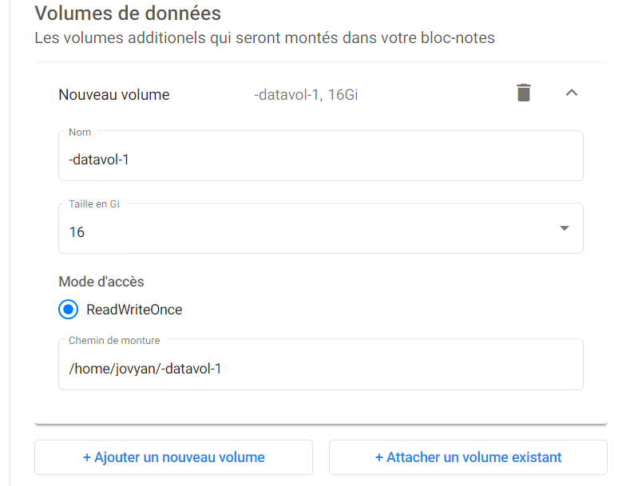
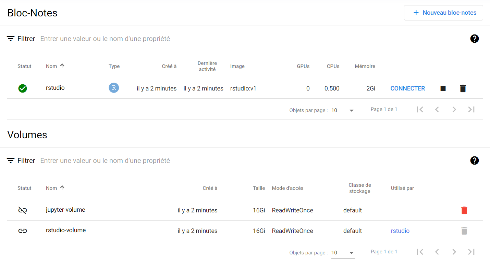

# Volumes Kubeflow (Disques)

Les volumes Kubeflow ont un concept similaire aux disques durs auxquels vous êtes habitué sur votre bureau Windows, Mac ou Linux. Les volumes Kubeflow sont parfois simplement appelés disques et sont soutenus par des disques SSD (Solid State Drives) rapides sous le capot !

## Installation

Lors de la création de votre serveur de bloc-note, vous demandez des disques en ajoutant des volumes de données à votre serveur de bloc-note (illustré ci-dessous, en allant dans « Options avancées »). Ils sont automatiquement montés dans le répertoire (« Mount Point ») que vous choisissez et constituent un moyen simple et fiable de conserver les données attachées à un serveur de bloc-note.

<!-- plus joli-ignorer -->
!!! Avertissement "Vous payez pour tous les disques que vous possédez, qu'ils soient connectés ou non à un serveur de bloc-note."
     Dès que vous créez un disque, vous le [payez](#pricing) jusqu'à ce qu'il soit [supprimé](#deleting-disk-storage), même si son serveur de bloc-note d'origine est supprimé. Voir [Suppression du stockage sur disque](#deleting-disk-storage) pour plus d'informations.

## Une fois que vous avez les bases...

Lorsque vous supprimez votre serveur de bloc-note, vos disques **ne sont pas supprimés**. Cela vous permet de réutiliser ultérieurement ce même disque (avec tout son contenu) sur un nouveau serveur de bloc-note (comme indiqué ci-dessus avec « Type = Existing » et le « Nom » défini sur le volume que vous souhaitez réutiliser). Si vous en avez terminé avec le disque et son contenu, [supprimez-le](#deleting-disk-storage).

## Suppression du stockage sur disque

Pour voir vos disques, consultez la section bloc-note Volumes de la page serveur de bloc-note (illustré ci-dessous). Vous pouvez supprimer n'importe quel disque non connecté (icône à gauche) en cliquant sur l'icône de la corbeille.

## Tarifs

<!-- plus joli-ignorer -->
??? info "Les modèles de tarification sont provisoires et peuvent changer."
     Au moment de la rédaction, les prix sont couverts par la plateforme pour les utilisateurs initiaux. Ces orientations expliquent comment les choses devraient être fixées à l'avenir, mais cela peut changer.

Lors du montage d'un disque, vous obtenez un [Disque managé Azure](https://azure.microsoft.com/en-us/pricing/details/managed-disks/). La tarification des **Disques gérés SSD Premium** indique le coût par disque en fonction de la taille. Notez que vous payez pour la taille du disque demandée, et non pour la quantité d'espace que vous utilisez actuellement.

<!-- plus joli-ignorer -->
??? info "Conseils pour minimiser les coûts."
     Vous pouvez minimiser les coûts en suspendant vos serveurs de bloc-notes lorsqu'ils ne sont pas utilisés. Un flux de travail typique peut ressembler à :

     - Créez un serveur de bloc-notes avec la quantité de stockage appropriée allouée à l'espace de travail et aux volumes de données.
     - Travaillez tout au long de la journée, en enregistrant les résultats dans le volume de données ou d'espace de travail, en fonction de vos besoins.
     - À la fin de la journée de travail, suspendez votre serveur de bloc-note pour éviter de le payer du jour au lendemain.
     - Le lendemain à 9h, reprenez votre serveur de bloc-note et poursuivez votre travail.
     - **Conseil :** Vous pouvez migrer votre espace de travail ou votre volume de données vers un nouveau serveur de bloc-notes sans perdre de données, car la destruction du serveur de bloc-notes n'affecte aucun espace de travail ou volume de données connecté.
